# CCMS — Complete Domain & Business Knowledge

**Audience:** a software developer who knows programming but nothing about banking or currency chests.
**Purpose:** explain *what CCMS does and how the business works*. A later "Technical Implementation & Codebase Deep Dive" document will explain *how the code does it*.
**Codebase reviewed:** `D:\Work\CCMS-RBL` (branch `UAT`) — ASP.NET WebForms application, apparently deployed for RBL Bank (evidence: repository name `CCMS-RBL`, an `RBLChestSlipReport` page and `'RBL Bank LTD'` literals in SQL).

## Contents

- [0. How to read this document (and how far to trust it)](#0-how-to-read-this-document-and-how-far-to-trust-it)
- [1. Executive Overview](#1-executive-overview)
- [2. What is CCMS?](#2-what-is-ccms)
- [3. Why CCMS Exists](#3-why-ccms-exists)
- [4. Banking Cash-Management Context](#4-banking-cash-management-context)
- [5. Currency Chest Explained](#5-currency-chest-explained)
- [6. CCMS Ecosystem](#6-ccms-ecosystem)
- [7. Branch vs Currency Chest](#7-branch-vs-currency-chest)
- [8. RBI and Its Role](#8-rbi-and-its-role)
- [9. Complete Physical Cash Lifecycle](#9-complete-physical-cash-lifecycle)
- [10. Roles and Actors](#10-roles-and-actors)
- [11. Abbreviations Master List](#11-abbreviations-master-list)
- [12. CCMS Terminology / Glossary](#12-ccms-terminology--glossary)
- [13. Core Master Data](#13-core-master-data)
- [14. Remittance Concepts — and the Naming Map](#14-remittance-concepts--and-the-naming-map)
- [15. Branch → Chest: sending surplus cash to the chest](#15-branch--chest-sending-surplus-cash-to-the-chest)
- [16. Chest → Branch: giving cash to a branch](#16-chest--branch-giving-cash-to-a-branch)
- [17. RBI Fresh Currency](#17-rbi-fresh-currency)
- [18. RBI Soiled Currency](#18-rbi-soiled-currency)
- [19. RBI Diversion](#19-rbi-diversion)
- [20. Chest ↔ Chest Movement](#20-chest--chest-movement)
- [21. Bins, Cabinets and Workstations — the physical storage model](#21-bins-cabinets-and-workstations--the-physical-storage-model)
- [22. Currency Sorting Flow](#22-currency-sorting-flow)
- [23. Currency Categories — usable, soiled, mutilated, fake](#23-currency-categories--usable-soiled-mutilated-fake)
- [24. Shortage, Excess and Discrepancies](#24-shortage-excess-and-discrepancies)
- [25. Cash in Transit](#25-cash-in-transit)
- [26. Maker / Checker](#26-maker--checker)
- [27. Status Lifecycle](#27-status-lifecycle)
- [28. RBI Incentives](#28-rbi-incentives)
- [29. RBI Penalties](#29-rbi-penalties)
- [30. Reimbursements and Claimable Expenses](#30-reimbursements-and-claimable-expenses)
- [31. Daily Remittance](#31-daily-remittance)
- [32. ATM Remittance](#32-atm-remittance)
- [33. Inter-Branch Transactions](#33-inter-branch-transactions)
- [34. Cancellation](#34-cancellation)
- [35. Reversal](#35-reversal)
- [36. Charge Handover](#36-charge-handover)
- [37. Reports](#37-reports)
- [38. Complete Real-World Scenarios](#38-complete-real-world-scenarios)
- [39. Complete Cash Journey](#39-complete-cash-journey)
- [40. CCMS Module Map](#40-ccms-module-map)
- [41. Concept Relationships](#41-concept-relationships)
- [42. Common Confusions](#42-common-confusions)
- [43. Frequently Asked Questions](#43-frequently-asked-questions)
- [44. If I Join the CCMS Project Tomorrow](#44-if-i-join-the-ccms-project-tomorrow)
- [45. Master Glossary / Quick Reference](#45-master-glossary--quick-reference)
- [46. Source / Uncertainty Notes](#46-source--uncertainty-notes)

---

## 0. How to read this document (and how far to trust it)

### 0.1 Source discipline

The brief for this document mentions an "existing CCMS project reference document". **No such document exists in the repository** (the only non-code file is the brief PDF itself). Therefore *every* statement below was derived from the application itself:

* screen titles, field labels and grid columns (`CCMS/Secure/**/*.aspx`),
* code-behind logic and role checks (`*.aspx.cs`),
* models, enums and constants (`CDAL/Models`, `CDAL/UtilityClass.cs`, `CDAL/MetaData.cs`),
* the few stored-procedure scripts that are checked in (`SQL/*.sql`, `SQL/*.txt`) — these are the **only** place where real database-side business rules are visible,
* the background scheduler (`BLL/Scheduler.cs`) and the Finacle message samples (`CCMS/FinacleIntegration/*.xml`).

Most stored procedures are **not** in the repository. Where a rule would live there, this document says so instead of guessing.

### 0.2 Tags used

| Tag | Meaning |
|---|---|
| **[APP]** | Confirmed from the application (screen, code, enum or checked-in SQL). |
| **[DOMAIN]** | General banking / RBI context. *Not* proven to be implemented by CCMS. |
| **[INFERRED]** | My reading of the evidence; probably right but not stated anywhere. |
| **[UNCLEAR]** | The material is ambiguous; the source wording is preserved. |
| **[NOT CONFIRMED]** | Mentioned in the brief or expected, but not found in the repository. |

### 0.3 Three corrections to the brief's assumptions (read these first)

1. **"Branch Inward Remittance" does not mean "a branch receives cash".** In CCMS the name describes the direction *from the point of view of the person entering the transaction*, and the counterparty is in the name. See §14 for the full naming map. In short:
   * *Branch Inward Remittance* = the **chest** records cash coming **in from a branch**.
   * *Branch Outward Remittance* = the **chest** records cash going **out to a branch**.
   * The branch's own screens are named the other way round: *Chest Outward Remittance* = branch sends cash **out to the chest**; *Chest Inward Remittance* = branch receives cash **in from the chest**.
2. **A branch-level retention limit does not exist in the application.** "Retention Limit (in Lacs)" is an attribute of a **currency chest** only. The brief's Scenario 2 ("Pune Branch has ₹40 lakh but its retention limit requires it to send the excess") is therefore written here as a business scenario whose *trigger is the branch manager's decision*, not a system rule. See §5.4.
3. **Some abbreviations in the brief are not present in the code** (e.g. `CEV`). They are listed as *not found* in §11 rather than invented.

---

## 1. Executive Overview

**CCMS** is the bank's **Currency Chest Management System**. It is the software that keeps an exact, auditable record of *physical cash* (bank notes and coins) as it moves between:

* the **Reserve Bank of India (RBI)** and the bank's **currency chests**,
* a **currency chest** and the **branches** that depend on it,
* a chest and **other banks' branches / other chests**,
* a chest and the **ATM cash-management units** and the **cash-carrying agencies** (vehicles, guards, custodians) that physically move the money.

Inside a chest, CCMS also tracks **where each note bundle physically sits** (cabinet → bin), how it is **sorted** by machines, and how the chest's **book balance reconciles with the physical balance** every day.

On top of that it handles the **money side-effects** of those movements: shortages/excesses, fake and mutilated notes, RBI incentives, RBI penalties, claimable expenses and their reimbursement, agency bills, petty cash, and postings to the bank's core-banking system (**Finacle**).

Everything sensitive follows a **Maker/Checker** rule: one person prepares, another approves.

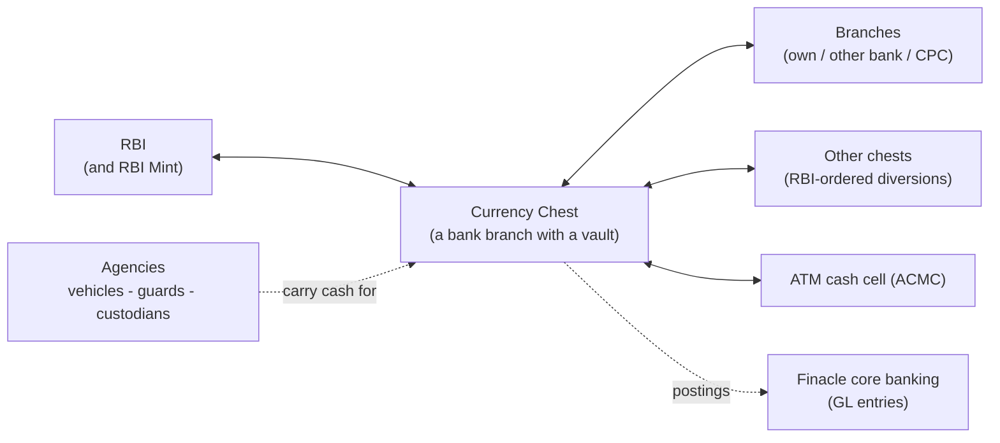

---

## 2. What is CCMS?

**Term** — *CCMS*
* **Simple meaning:** software to run a bank's "cash warehouse".
* **CCMS meaning:** the transaction, inventory and accounting system for **currency chests** and the **branches/agencies linked to them**. The initials expand to *Currency Chest Management System* — the expansion is inferred from the application/repository name and the domain; the code never spells it out. **[INFERRED]**
* **Why it exists:** the RBI requires banks that operate a currency chest to account for every note; doing that on paper/spreadsheets across hundreds of branches is error-prone.
* **Who uses it:** chest staff, branch staff, ATM-cell staff, head-office users, administrators (§10).
* **What happens:** each physical movement of cash is entered as a transaction, approved by a checker, and confirmed by the receiving side; stock in bins is updated; reports show balances.
* **Example:** Pune Branch needs ₹25 lakh → raises a request → the chest prepares and dispatches → Pune confirms receipt → both sides' balances move.
* **Related:** Currency Chest (§5), Remittance (§14), Maker/Checker (§26).

### 2.1 The modules (application areas)

The screens are grouped into modules. **[APP]** The module *codes* below are folder/namespace names; their long forms are **not confirmed** in the code and are not guessed here.

| Code | What it covers (business terms) | # screens |
|---|---|---|
| `CDR` | Common master data: branches, other banks, RBI locations, denominations, handling units, places | 10 |
| `USA` | Users, roles, permissions, holidays, configurable parameters, mail/password settings | 21 |
| `BSS` | **Chest-side** cash transactions with branches: chest→branch, branch→chest, ATM outward, excess cash delivery, cancellation, proximity groups, commission bills | 11 |
| `BTS` | **Branch-side** requests and receipts: inward/outward remittance requests, chest outward/inward remittance, daily remittance, ATM order, inter-branch | 11 |
| `RFS` | **RBI-facing**: fresh currency, soiled notes, diversions, incentives, penalties, claimable expenses, reimbursement, charge handover | 16 |
| `BMS` | **Physical stock inside the chest**: cabinets, bins, deposit/withdrawal, sorting, workstations, fake-note register, withdrawal adjustment plans | 17 |
| `AMS` | **Agencies**: contracted agencies, vehicles, personnel, shifts, trip scheduling, trip sheets, attendance, bills | 13 |
| `AFS` | **Accounts**: debit notes, credit notes, petty cash, Finacle integration log | 5 |
| `EM` | **Exceptions**: inward reversal, outward reversal | 2 |
| `MIS` | **Reports** (about 70) | 71 |

---

## 3. Why CCMS Exists

### 3.1 The problem in one paragraph

A bank must give branches the right amount of cash, in the right denominations, at the right time — and take surplus and unusable cash back — without ever losing track of a note. At the same time it must report to RBI, claim RBI's incentives and reimbursements, and avoid RBI penalties. Doing this across many branches, vehicles and shifts, with multiple people touching the cash, needs a **single system of record** with approvals, references between related transactions, and reconciliation.

### 3.2 What goes wrong without such a system

* Cash is dispatched but nobody can prove it arrived.
* A shortage is discovered days later and nobody can say who was responsible.
* Fake/mutilated notes are found but cannot be traced to the depositing branch.
* The chest's book balance and its physical stock disagree.
* RBI incentives are under-claimed; RBI penalties are levied without records to dispute them.
* Vehicles and guards are planned by hand and billed inaccurately.

CCMS's design answers each of these: **linked transactions** (each receipt points to the dispatch it answers), **Maker/Checker**, **discrepancy capture per denomination**, **debit/credit notes**, **bin-level stock logs**, **daily control sheet**, **incentive/penalty modules**, and **agency trip/bill modules**. **[INFERRED from feature set]**

---

## 4. Banking Cash-Management Context

*General domain context — not specific to CCMS.* **[DOMAIN]**

* **Bank notes are printed and issued by the RBI.** Banks do not print money; they *obtain* it from RBI and *return* worn-out notes to RBI.
* **Currency chest:** a vault, at a bank branch, that acts as RBI's stockpoint. RBI deposits new notes with the chest bank (technically the notes remain RBI's property until issued to the public). The chest bank then supplies other branches (its own and often other banks').
* **Why branches do not each hold RBI-grade stock:** RBI authorises only a limited number of vaults as chests; other branches keep only day-to-day cash and draw from / return to their linked chest.
* **Notes are graded:** *fresh/issuable* notes can go back to customers/ATMs; *soiled* notes are worn out and must be returned to RBI; *mutilated* notes are damaged/torn and are evaluated by RBI; *fake* (counterfeit) notes must be detected, impounded and reported.
* **Denominations, bundles and handling units:** cash is counted in **bundles** (typically 100 notes) rather than notes; totals are in ₹, often expressed in **lakh** (1,00,000) or **crore** (1,00,00,000).
* **Cash-in-transit (CIT) agencies** carry cash in armoured vehicles with guards.

The rest of this document says explicitly when CCMS *implements* one of these ideas.

---

## 5. Currency Chest Explained

### 5.1 What a currency chest is

**Term** — *Currency Chest*
* **Simple meaning:** a secure vault, inside a bank branch, that stores large amounts of cash and supplies other branches.
* **CCMS meaning:** a **branch record flagged "Is Currency Chest? = Yes"**. **[APP]** (`CDR/BranchesMaster`). It has its own stock (bins, cabinets, workstations), its own users (chest staff), its own configuration parameters, and *linked branches* that draw cash from it.
* **Why it exists in CCMS:** every cash movement needs a "home" whose balance goes up or down; the chest is that home.
* **Who uses it:** chest users (`WO`), chest head / local administrator (`LA`), bin operators (`BO`).
* **Example:** *"Pune Currency Chest"* stores ₹9 crore; it serves 40 Pune-area branches.
* **Related:** Branch, Retention Limit, Bins, Linked Chest.

### 5.2 How a chest differs from an ordinary branch

| Aspect | Ordinary branch | Currency chest |
|---|---|---|
| Master data flag | `Is Currency Chest? = No`, has a *Linked Currency Chest* | `Is Currency Chest? = Yes` **[APP]** |
| Cash held | day-to-day working cash | large stock, tracked per bin/denomination/category |
| Talks to RBI | no | yes (fresh, soiled, diversions, incentives, penalties) |
| Physical storage model | not modelled | cabinets, bins, workstations, floor **[APP]** |
| Extra attributes | distance from chest, area type | chest class (A/B/C), retention limit, linked RBI location, GL account numbers **[APP]** |
| Typical CCMS role | Branch User (`BU`), Branch Manager (`BM`) | Chest User (`WO`), Local Administrator (`LA`) |

Branch master also carries three *other* flags **[APP]**: **Is ACMC Branch?**, **Is CPC Branch?**, and **Linked Chest Type = Own / Other** (§7).

### 5.3 Why a branch is marked as a chest

Because RBI authorises only certain branches as chests **[DOMAIN]**, CCMS can't assume every branch has a vault. The branch master lets an administrator (`CA`/`HU`) declare it; when the flag is *Yes* the form additionally asks for **Chest Class, Distance from RBI location, RBI reporting office, Retention Limit and account numbers**. When a Local Administrator (`LA`) adds an ordinary branch, the app pre-fills *Linked Currency Chest = the LA's own chest* and *Linked Chest Type = Own*, and hides the chest flag. **[APP]** (`BranchesMaster.aspx.cs`, `BindControlForCALA`)

### 5.4 Retention limit

* **What the app has:** a numeric field **"Retention Limit (in Lacs)"**, visible **only when Is Currency Chest = Yes**, editable by `CA`/`HU` (hidden for `LA`). The **Currency Chest Control Report** shows *Retention Limit*, *Total Balances*, *Issuable*, *Non-Issuable*, *Unsorted*, *Inflow*, *Outflow*, *Total Balance as of the Retention Limit* and *Issuable Note held as of CBL*. **[APP]**
* **What the app does *not* show:** any screen or code that *blocks* or *alerts* when a chest exceeds or falls below the limit. If that exists, it would be inside database procedures that are not in the repository. **[NOT CONFIRMED]**
* **`CBL`:** used only as a report column heading; full form **not confirmed from available material**. **[UNCLEAR]**
* **Business meaning (general):** RBI prescribes how much cash a chest may hold; surplus is expected to go back to RBI and shortfalls are met by fresh-currency indents. **[DOMAIN]** — this is why the RBI-facing flows in §17–§19 exist.
* **No branch-level retention limit** exists in the application. **[APP — absence]**

### 5.5 How chests interact

* **With RBI:** fresh currency indent/receipt, soiled notes remittance, diversion, incentive claim, penalty, reimbursement (§17–§19, §28–§30).
* **With another chest:** only through an **RBI Diversion Order** (§19–§20). The other chest is chosen by *Bank + Chest name* on the order. **[APP]**
* **With branches:** the request → dispatch → receipt chains (§15, §16).
* **With the ATM cell:** ATM remittance order → ATM outward remittance; excess cash comes back (§32).

---

## 6. CCMS Ecosystem

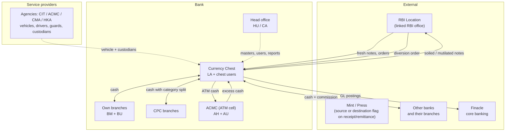

For every actor: who they are, why they touch CCMS, what they send/receive, what they do.

| Actor | Who / why | Sends | Receives | Typical CCMS transactions |
|---|---|---|---|---|
| **RBI** | Central bank; owner of the notes; regulator | Fresh notes; soiled-note remittance *orders*; diversion orders; incentives; reimbursements; penalties | Soiled/mutilated notes; surplus (via soiled/other remittances) | Fresh Currency Indent/Receipt, Soiled Remittance Order/Soiled Notes Remittance, RBI Diversion Order, Incentive Claim/Receipt, Penalty Records, Reimbursement Receipt **[APP]** |
| **RBI Location** | The RBI office a chest is linked to (master: *RBI Locations Master*) | — | Indents | "Linked RBI Location" on branch/indent/soiled order **[APP]** |
| **Mint** | Checkbox "Cash Received From Mint" (fresh receipt) and "Cash Sent to Mint" (soiled remittance) | — | — | Marks whether a receipt/remittance was with a Mint rather than an RBI office **[APP]**; what exactly a Mint is here is **[DOMAIN]** (currency printing/coin-minting unit) |
| **Currency chest** | Vault + staff | Cash to branches; soiled to RBI; cash to other chests | Cash from RBI, branches, other chests, ATM cell | all of BSS/RFS/BMS |
| **Ordinary branch** | Retail branch linked to a chest | Surplus cash; requests | Cash it requested | Inward/Outward Remittance Request, Chest Outward/Inward Remittance, Inter-Branch **[APP]** |
| **CPC branch** | A "CPC Branch" (flag on branch master). Full form not confirmed. | Cash with a **category split** (see §23) | — | Chest Outward Remittance with categories **[APP]** |
| **Other banks / branches** | Master: *Other Banks Master*, *Other Bank Branches*; branch type "**Other Bank / DSB**" | Cash deposited at this bank's chest (a chest can serve other banks) | Cash; commission bills | Branch Inward/Outward Remittance (type *Other*), Commission Bill Generation/Receipt, Inter-Branch **[APP]** |
| **ATM cell (ACMC)** | Branches flagged "Is ACMC Branch?"; users `AH` (ACMC Head), `AU` (ACMC User). Full form of ACMC **not confirmed**. | ATM Remittance Order; excess cash | ATM cash | ATM Remittance Order, ATM Outward Remittance, Excess Cash Delivery **[APP]** |
| **Agency / custodian** | Contracted vehicle + security providers. Categories `CMA`, `ACMC`, `CIT`, `HKA` (long forms not confirmed; `CIT` is standard for *cash in transit* **[DOMAIN]**). Personnel types: Driver, Loader, Gunman, Security Guard, Custodian **[APP]** | Vehicle and crew; bills | Trip schedules; payment | Vehicle Trip Scheduling, Trip Sheet, Attendance, Personnel/Vehicles bill generation, Agency Bill Voucher **[APP]** |
| **Finacle** | The bank's core-banking system | — | Accounting postings (`XferTrnAdd` messages) | Debit notes, soiled-note remittance, claimable-expense voucher **[APP]** |

---

## 7. Branch vs Currency Chest

### 7.1 The relationship

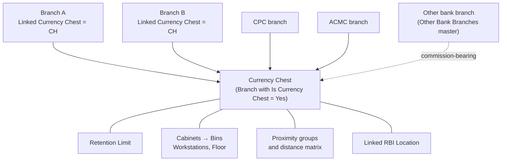

**[APP]** facts about the link: a branch stores **Linked Currency Chest**, **Distance From Chest (KM)**, **Branch Area Type** (Rural / Urban / Semi Urban), **Linked Chest Type = Own / Other** and **Bank Name** (for an *Other* chest). All users are tied to one branch, and their permissions and data are scoped to that branch (a chest sees its linked branches).

### 7.2 What "Linked Chest Type = Own / Other" means

The dropdown exists, and there is an enum `LinkedChestType {Own, Other}` **[APP]**. The most natural reading is that a branch may be served by the bank's *own* chest or by *another bank's* chest **[INFERRED]**; the checked-in material does not explain further.

### 7.3 Branch types used in remittance screens **[APP]**

| Branch Type (enum `BranchType`) | Shown as | Meaning inside the transactions |
|---|---|---|
| `Own` | Own Branch | One of the bank's own branches linked to this chest |
| `Other` | Other Bank / DSB | A branch of another bank (bank + branch chosen from masters); attracts **commission**; the screen captures "Total Amount" and "Total Commission Amount" |
| `CPC` | CPC Branch | A branch that sends cash **already grouped by currency category**; the detail grid has an extra category column |
| ACMC (constant `ACMCBranch`) | ACMC | The ATM cell, whose cash is referenced through an **Excess Cash Delivery (ECD)** record instead of a Chest Outward Remittance |

`DSB` — long form **not confirmed**. `CPC` — long form **not confirmed**. **[UNCLEAR]**

---

## 8. RBI and Its Role

**Term** — *RBI (Reserve Bank of India)*
* **Simple meaning:** India's central bank.
* **CCMS meaning:** the external authority that (a) supplies fresh notes to chests, (b) takes back soiled/mutilated notes, (c) can direct one chest to send currency to another, (d) pays incentives/reimbursements and (e) levies penalties. Modelled through *RBI Locations Master*, *Linked RBI Location*, and the RFS module. **[APP]**

| Direction | What | CCMS screens |
|---|---|---|
| Chest → RBI (request) | Ask for fresh notes | *Fresh Currency Indent* |
| RBI → Chest (cash) | Receive fresh notes | *Fresh Currency Receipt* |
| RBI → Chest (instruction) | "Send soiled notes on date X" | *Soiled Remittance Order* |
| Chest → RBI (cash) | Send soiled/mutilated/adjudicated notes | *Soiled Notes Remittance* |
| RBI → Chest (instruction) | "Send ₹N to Chest Z before date D" or "expect ₹N from Chest Z" | *RBI Diversion Order* |
| Chest ↔ Chest (cash) | Carry out the order | *Diversion Outward / Inward Remittance* |
| Chest → RBI (money claim) | Claim incentives | *RBI Incentive Claim Generation* |
| RBI → Chest (money) | Pay incentives | *RBI Incentive Claim Receipt* |
| RBI → Chest (money) | Reimburse claimable expenses | *Reimbursement Receipt* |
| RBI → Chest (penalty) | Levy penalty for fake/re-issuable/shortage/mutilated notes | *RBI Penalty Records* (rates in *RBI Penalty Rules*) |

Details: §17, §18, §19, §28, §29, §30.

---

## 9. Complete Physical Cash Lifecycle

### 9.1 The big loop

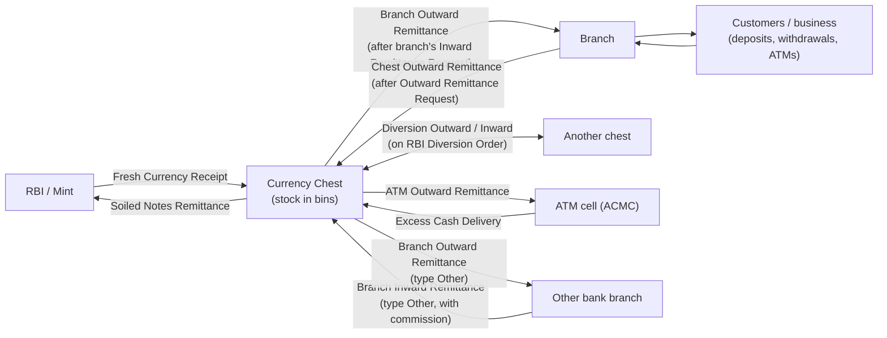

### 9.2 Where can cash come **from** (into a chest)?

| Source | CCMS transaction (chest side) | Cash lands in |
|---|---|---|
| RBI / Mint | Fresh Currency Receipt | Sorted bin **[APP]** (Deposit purpose FCR = Sorted) |
| Own branch (surplus) | Branch Inward Remittance | **Unsorted** bin (Deposit purpose BIR = Unsorted) **[APP]** |
| CPC branch | Branch Inward Remittance (type CPC, with categories) | as above |
| Other bank branch | Branch Inward Remittance (type Other) | as above |
| ACMC (excess) | Branch Inward Remittance (type ACMC, ref. Excess Cash Delivery) | as above |
| Another chest (diversion) | Diversion Inward Remittance | Sorted bin (Deposit purpose DIR = Sorted) |
| Sorting output | Cash Deposit Record, purpose *Cash Sorting Records* | Sorted bins |
| Bin shifting / other | Cash Deposit Record purposes *Bin Shifting* / *Other* | any |

### 9.3 Where can cash **go** (out of a chest)?

| Destination | CCMS transaction | Cash comes from |
|---|---|---|
| Own/CPC/other-bank branch | Branch Outward Remittance | Sorted bins via Cash Withdrawal (purpose *Inward Remittance Request*) |
| ATM cell | ATM Outward Remittance | Withdrawal purpose *ATM Remittance Order* |
| RBI | Soiled Notes Remittance | Withdrawal purpose *Soiled Remittance Order* |
| Another chest | Diversion Outward Remittance | Withdrawal purpose *Diversion Outward* |
| Sorting workstation | Cash Withdrawal purpose *Cash Sorting* | Unsorted bins |
| Other bin | Withdrawal purposes *Bin Shifting* / *Other* | any |

(All purposes above are the actual entries of the Deposit/Withdrawal purpose dictionaries in `CashDepositRecords.aspx.cs` / `CashWithdrawalRecords.aspx.cs`. **[APP]**)

### 9.4 Why does cash move?

* **Branch needs cash** (customer withdrawals, ATM loading) → chest supplies it.
* **Branch has surplus / unfit cash** → returns it to the chest.
* **Chest needs fresh currency** → indent to RBI.
* **Chest has soiled currency** or RBI orders a remittance → chest sends it to RBI.
* **RBI rebalances the system** → diversion order moves cash chest→chest.
* **ATMs need cash / have leftover cash** → ATM cell requests / returns it.

### 9.5 How does CCMS track it?

Three interlocking mechanisms **[APP]**:

1. **Transactions with references** — every receipt names the dispatch it answers (e.g., `ReferenceBorID`, `ReferenceCorID`, `ReferenceIrrID`).
2. **A branch/chest balance log** — approved transactions call `_PROC_UPDATE_BRANCH_CC_BALANCE_LOG` with a title such as `DELIVERY_NOTE` or `RECEIPT_NOTE` (seen in the checked-in stored procedures).
3. **A bin cash log** — physical deposits/withdrawals are logged per bin (`_PROC_BinCashLog`, title e.g. `LOC_DEPOSITE`), and reports such as *Control Sheet* compare book vs. physical balances (§21).

Transaction IDs look like `FunctionCode-BranchCode-ddMMyy-HHmm-Number` (built in code, e.g. in `BranchInwardRemittance.aspx.cs`). **[APP]**


---

## 10. Roles and Actors

### 10.1 The role codes actually in the application

Role codes are the enum `SystemRole` in `CDAL/UtilityClass.cs`. **[APP]**

| Code | Name in the app | Business person (my mapping to the brief's names) | Level |
|---|---|---|---|
| `PM` | Product Manager | Vendor-side product administrator (the master page treats `PM` specially) | Platform |
| `PB` | Product Buyer | Vendor/bank buyer-side administrator **[UNCLEAR]** | Platform |
| `CA` | Client Administrator | Bank-level administrator: branch masters, chest flags, retention limits, Finacle log | Bank |
| `HU` | Head Office User | **Head Office User**: same rights as `CA` on branch master, Finacle log and many reports | Bank |
| `LA` | Local Administrator | **Chest Head** — the *checker* for chest-side transactions **[INFERRED name; role behaviour is [APP]]** | Chest |
| `WO` | Chest User | **Chest staff / maker** (the enum's comment shows the code once stood for "Workstation Operator") | Chest |
| `BO` | Bin Operator | Staff who handle bins; can prepare some chest transactions | Chest |
| `BM` | Branch Manager | **Branch Head** — the *checker* for branch-side transactions | Branch |
| `BU` | Branch User | **Branch User** — the *maker* at a branch | Branch |
| `AH` | ACMC Head | **ACMC Head** — approver in the ATM cell | ACMC |
| `AU` | ACMC User | **ACMC User** — maker in the ATM cell | ACMC |
| `IO` | ITAM Maker | **ITAM Maker** | ? |
| `IT` | ITAM Checker | **ITAM Checker** | ? |

**About ITAM:** `IO`/`IT` exist as enum entries only; I found **no page or logic** that checks them, and `ITAM` is never expanded. **[UNCLEAR]** What ITAM stands for and what these users approve is **not confirmed from available material**.

What each user may *see and do* is not hard-coded per role; it is a **permission matrix** (`USA/RoleAuthorityMatrix`) giving each role *Full Access / Read Only / Access Denied* per screen (`UserAccessType`). **[APP]** The role checks in code-behind only decide *behaviour inside* a screen (e.g., show the Approve/Reject radio).

### 10.2 Who does what — evidence from role checks

| Business action | Maker | Checker | Evidence |
|---|---|---|---|
| Branch asks for cash (*Inward Remittance Request*) | `BU` | `BM` | `BM` sees the "latest request" to approve; `BU` view hides the Approve control (`InwardRemittanceRequest.aspx.cs`, `SetMakerChecker`) |
| Branch asks chest to collect surplus (*Outward Remittance Request*) | `BU` | `BM` | same pattern |
| Branch dispatches cash to chest (*Chest Outward Remittance*) | `BU` | `BM` | mostly `BM`/`BU` checks |
| Branch receives cash from chest (*Chest Inward Remittance*) | `BU` | `BM` | same |
| Inter-branch remittance/receipt | `BU` | `BM` | same |
| Chest sends cash to a branch (*Branch Outward Remittance*) | `WO`/`BO` | `LA` | `SetMakerChecker`: `LA` sees Approve; `WO`/`BO` do not |
| Chest receives cash from a branch (*Branch Inward Remittance*) | `WO`/`BO` | `LA` | same |
| Fresh indent / receipt, soiled order, diversion order & remittances | `WO` (LA also) | `LA` | `LA` dominates these pages |
| Cash sorting, workload, deposit, withdrawal | chest staff | `LA` | screens carry *Checker*/"Reason For Reject" |
| Debit/credit notes | chest staff | `LA` | `SetMakerChecker` in `BranchDebitNote.aspx.cs` |
| ATM remittance order | `AU` | `AH` (and `BM`) | role checks in `ATMRemittanceOrder.aspx.cs` |
| ATM outward remittance | chest staff | `LA` | `LA`-only paths |
| Excess cash delivery | `AU` | `AH` | role checks in `ExcessCashDelivery.aspx.cs` |
| Inward reversal (undo a chest→branch dispatch) | — | `LA` | `EM/InwardReversal.aspx.cs` |
| Outward reversal (undo a branch→chest dispatch) | `BU` | `BM` | role checks in `EM/OutwardReversal.aspx.cs` mention `BM` (11×) and `BU` (5×); the maker/checker split is **[INFERRED]** |

> **Automatic exception:** requests created by the **Daily Remittance** scheduler are *saved as already approved* (`model.IsApprove = true` in `BLL/Scheduler.cs`). **[APP]**

### 10.3 Maker/Checker — the business idea

* **Concept (four-eyes principle)**: one person **prepares** (the *maker*), a *different* person **reviews and approves or rejects** (the *checker*). Cash movement is high-risk, so nobody alone can both create and authorise a transaction. **[DOMAIN concept; implemented in CCMS as below]**
* **How it shows in CCMS** **[APP]**:
  * the record is saved with `IsApprove = NULL` (*pending*);
  * the checker opens it, sees its details, and picks **Approve** (`IsApprove = 1`) or **Reject** (`IsApprove = 0`), with a *Reason For Reject*;
  * only **Approved** transactions move stock and balances (e.g., in the checked-in `BSS_BranchOutwardRemittanceMaster_Upsert`, the balance-log procedure is called only `IF @IsApprove=1`);
  * the maker gets a notification e-mail on the outcome ("To BU On Status Inward/Outward Remittance Request" templates); the checker gets an e-mail when a request needs approval ("To LA/BM On … For Approval").
* The screens use the label **"Checker"** for a status column with values **Pending / Approved / Rejected** (and *Cancelled* for an approved-then-cancelled record). **[APP]** (SQL `CASE` expressions in `SQL/2.SP_ALTER_GET.sql`)
* A guard: for some paths the app refuses a *Reject* with "You Can't Reject this Transaction!". **[APP]** (`BranchInwardRemittance.aspx.cs`)

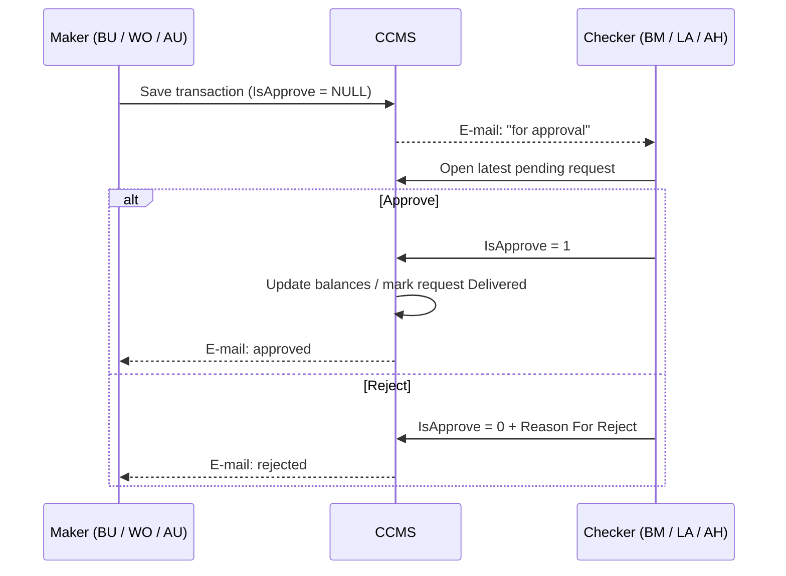

---

## 11. Abbreviations Master List

Only abbreviations **found in the application** are listed. Full forms are given **only** when the application spells them out or when the expansion is standard and harmless; otherwise: **"Full form not confirmed from available material."**

### 11.1 People / role codes — see §10.1

### 11.2 Business and module abbreviations

| Abbrev. | Full form | Meaning in CCMS | Where used | Basis |
|---|---|---|---|---|
| CCMS | Currency Chest Management System | The application | Everywhere | **[INFERRED]** |
| RBI | Reserve Bank of India | Central bank | RFS, masters | [APP] label "RBI" |
| RBL | RBL Bank Ltd | The deploying bank | SQL literal `'RBL Bank LTD'`; repo name | [APP] |
| BOM, SBI | *Full form not confirmed from available material* | Enum `BankName { BOM=1, SBI=2 }` — suggests other bank deployments of the product | `UtilityClass.cs` | [UNCLEAR] |
| ATM | Automated Teller Machine | Cash machines served by the ATM cell | BTS/BSS, denomination flag "Used for ATM?" | [DOMAIN] |
| ACMC | *Full form not confirmed from available material* | A branch flagged "Is ACMC Branch?"; the ATM cash-management unit; also an agency category | Branch master, ATM screens, roles `AH`/`AU` | [UNCLEAR] |
| CIT | Cash in Transit | Armoured cash carriers ("CIT Agency"); agency category code | Remittance screens, `AgencyCategoryCode` | [DOMAIN] expansion; [APP] usage |
| CMA | *Full form not confirmed from available material* | Agency category code | `AgencyCategoryCode {CMA, ACMC, CIT, HKA}` | [UNCLEAR] |
| HKA | *Full form not confirmed from available material* | Agency category code | same | [UNCLEAR] |
| CPC | *Full form not confirmed from available material* | "CPC Branch": branch whose remittances carry a currency-category split | Branch master, remittance screens | [UNCLEAR] |
| DSB | *Full form not confirmed from available material* | Appears in the label "Other Bank / DSB" | `BranchType.Other` description | [UNCLEAR] |
| CC / CCBranchID | Currency Chest (branch) | The chest that owns a transaction | database column names | [INFERRED] |
| CBL | *Full form not confirmed from available material* (could be a "balance limit" or the "CC balance log"; not stated) | Report column "Issuable Note held as of CBL" | Chest Control Report | [UNCLEAR] |
| SBN | *Full form not confirmed from available material* (in Indian usage often "Specified Bank Notes") | Name of a report file; the page shows ₹500/₹1000 notes and coins in Part-A/B/C | `MIS/SBNInOutFlow` | [UNCLEAR] |
| UET | *Full form not confirmed from available material* | Part of a page name (*Branch Remittance Adjustment*) | `BMS/BranchRemmitanceForUET` | [UNCLEAR] |
| ITAM | *Full form not confirmed from available material* | Roles `IO`/`IT`, unused in logic | `SystemRole` | [UNCLEAR] |
| GL | General Ledger (bank's accounting books) | Not used as a label. The equivalent is the set of **"… Account Number"** fields on the branch master | CDR/BranchesMaster | [DOMAIN]; term "GL" itself **not found** |
| CEV | — | **Not found anywhere in the application.** The brief's guess "CEV = claimable expense voucher" cannot be confirmed. The screen is called *Claimable Expenses Voucher* | — | [NOT CONFIRMED] |
| MIS | Management Information System (reports) | Reporting module and "Monthly MIS Report" | MIS folder | [DOMAIN] |
| IFSC | Indian Financial System Code | Branch identifier code | Branch and other-bank-branch masters | [DOMAIN] |
| INR / ₹ | Indian Rupee | Currency | everywhere | — |
| KM | Kilometre | Distances (chest→branch, trips) | masters, trip sheet | — |
| RTO | Regional Transport Office | Vehicle registration number | vehicle masters | [DOMAIN] |
| PUC | Pollution Under Control (certificate) | Vehicle document with an expiry date | vehicle masters | [DOMAIN] |
| RC | Registration Certificate ("RC Book Validity") | Vehicle document | vehicle masters | [DOMAIN] |
| LMV / HMV | Light / Heavy Motor Vehicle | Vehicle class and driver-licence type | `VehicleType` | [DOMAIN] |
| OT | Overtime | "Overtime (OT) Rate" for vehicles | Agencies Vehicles Master | [APP] |
| CGST / SGST | Central / State Goods & Services Tax | Tax percentages used in bills | Configurable Parameters | [DOMAIN] |
| NIL / Half / Full value | — | Value allowed for a mutilated note (see §23) | Debit Note | [APP] |
| API Tran ID / Status / Date | — | Reference returned by the Finacle call | Soiled Notes Remittance, Claimable Expenses Voucher, Debit Note | [APP] |
| Lob Amount | *Full form not confirmed from available material* | Amount-range filter label in search panels | many screens | [UNCLEAR] |

### 11.3 Transaction-type abbreviations (developer shorthand — used in code, IDs and tables)

| Abbrev. | Full form (the screen name) | Note |
|---|---|---|
| IRR | Inward Remittance Request | branch → asks chest for cash |
| BOR | Branch Outward Remittance | chest → branch cash; answers an IRR |
| CIR | Chest Inward Remittance | branch's receipt of that cash; answers a BOR |
| ORR | Outward Remittance Request | branch → asks chest to collect surplus |
| COR | Chest Outward Remittance | branch's dispatch of cash to chest; answers an ORR |
| BIR | Branch Inward Remittance | chest's receipt of that cash; answers a COR |
| CIA | Chest Inward Acknowledgement | screen title "Remittances Acknowledgement" |
| IBR / IBI | Inter Branch Remittance / Inter Branch Receipt | branch → branch |
| DRR | Daily Remittance Request | standing daily request (auto-generates IRRs) |
| ARO | ATM Remittance Order | ATM cell's request to chest |
| AOR | ATM Outward Remittance | chest issues ATM cash |
| ECD | Excess Cash Delivery | ATM cell returns cash |
| FCI / FCR | Fresh Currency Indent / Receipt | (`FCRID` in `BMSFakeCurrencyNoteRecords` is a *different* "FCR" — Fake Currency Records; beware) |
| SRO / SNR | Soiled Remittance Order / Soiled Notes Remittance | SNR is the *function code* seen in SQL |
| RDO / RDOR / RDIR | RBI Diversion Order / Diversion Outward / Diversion Inward Remittance | The *Chestwise Key Transactions* report headings call the last two **DOR** and **DIR** |
| CDR / CWR / CSR / CSW | Cash Deposit / Withdrawal / Sorting Records; Cash Sorting Workload | (`CDR` is also the master-data module name — beware) |
| DCN / BCN | Branch Debit Note / Branch Credit Note | |
| CHS | Charge Handover Screen | |
| COM: `CommBill` | Commission Bill | |

---

## 12. CCMS Terminology / Glossary

Format per term: **Simple meaning → CCMS meaning → Why it matters → Example → Related.** Statements are **[APP]** unless tagged.

### 12.1 Places, people and things

| Term | Simple meaning | CCMS meaning | Why it matters | Example | Related |
|---|---|---|---|---|---|
| **Currency Chest** | Bank vault acting as RBI stock-point | Branch with *Is Currency Chest = Yes* | All stock lives here | Pune Chest | §5 |
| **Branch** | A bank office | Any row in *Branches Master*; may be Own / Other Bank / CPC / ACMC | Source or sink of cash | Kothrud Branch | §7 |
| **Linked Currency Chest** | The chest a branch draws from | Field on branch master | Decides which chest sees the branch's requests | Kothrud → Pune Chest | §7 |
| **Custodian** | Person accompanying cash | Personnel type `CUSTODIAN`; two custodian names are captured on dispatch (or free-text when self-delivered) | Accountability during transport | Custodian 1 = R. Patil | Vehicle, Agency |
| **Agency** | Contracted service company | *Contracted Agencies Master* with category `CIT/ACMC/CMA/HKA`, contract period | Supplies vehicles and crew, gets billed | "XYZ Securities" | AMS |
| **Vehicle** | Cash-carrying van | Agency vehicle, chest-owned vehicle or branch-owned vehicle; type LMV/HMV; documents with expiry dates | Trips are scheduled and billed per vehicle | MH12-AB-1234 | Trip sheet |
| **Workstation** | Sorting machine station | *Currency Sorting Workstation*: code, Manual/Automatic operation, machine description | Where unsorted notes become sorted | WS-01 | §21–22 |
| **Cabinet** | Steel storage unit in the vault | *Cabinets Master*: code, number of levels, number of bins | Groups bins | CAB-03 | Bin |
| **Bin** | Compartment holding one denomination/category | *Bins Master*: number, primary allocation (Sorted/Unsorted), denomination, class, state, category, handling unit, max capacity | Physical location of stock | Bin 03-05 = ₹500 Fresh, capacity 200 bundles | §21 |
| **Floor** | Working area outside bins/workstations | Stock "on floor" (e.g., unsorted remainder) | Must be zero for control reports | — | Control Sheet |
| **Proximity Group** | Set of branches close to each other | *Proximity Group Master* + *Branches Proximity Groups* | One vehicle trip can serve the group | "Pune East" | Trip scheduling |
| **RBI Location** | RBI regional office | *RBI Locations Master* | Where indents/soiled go | RBI Pune | §8 |

### 12.2 Money and notes

| Term | Simple meaning | CCMS meaning | Why it matters | Example | Related |
|---|---|---|---|---|---|
| **Denomination** | Note/coin face value | *Denominations Master*: value, class (Notes/Coins), "Used for ATM?", "Is Small Coin?" | Every quantity is per denomination | ₹500 | §14 |
| **Handling Unit** | Packaging unit | *Currency Handling Units*: unit name, *Count Per Unit*, default unit | Quantities are entered in units; amount = value × count × units | Bundle = 100 notes | §13 |
| **Fresh Currency** | Newly issued notes | Category received on *Fresh Currency Receipt* | Feeds issuable stock | 200 bundles of ₹500 | §17 |
| **Issuable** | Fit for re-issue | Stock category used in reports (Issuable / ATM / Fresh) | What branches and ATMs can be given | — | §23 |
| **Soiled Currency** | Worn-out but genuine | Category "Soiled Notes"; goes to RBI via *Soiled Notes Remittance* | RBI takes it back | — | §18 |
| **Mutilated Note** | Torn/damaged note | Debit-note types *Half Value / NIL Value*; category in soiled remittance; "adjudicated" | Value paid depends on damage | half note | §23 |
| **Fake Currency** | Counterfeit note | *Fake Currency Note Records* (serial, reason of suspicion, RBI jurisdiction, image) and debit-note type *Fake* | Must be recorded and debited | ₹2000 fake | §23 |
| **Sticky Notes** | Stuck-together notes | A stock category in the quality report | Needs separate handling | — | §23 |
| **Sorted / Unsorted** | Checked & graded vs raw | Bin *Primary Allocation* and deposit/withdrawal *Transaction Type* (Sorted/Unsorted/Both) | Raw branch cash goes to Unsorted bins first | — | §21–22 |
| **Usable / Non-usable** | Fit / unfit notes | `CurrencyState` on a bin | Reports "Usable/Non-Usable Balance" | — | §23 |
| **Sorting** | Machine grading of notes | *Cash Sorting Records* output by category | Converts raw cash into issuable / soiled etc. | 50 bundles processed | §22 |
| **Excess / Shortage** | More / less than expected | Difference between sent and received amounts; per-denomination *Discrepancy* | Financial and audit impact | ₹1,000 short | §24 |
| **Discrepancy** | Any mismatch | *Difference Amount (INR)* fields; *Discrepancies Report* | Triggers debit/credit notes | — | §24 |

### 12.3 Movements and documents

| Term | Simple meaning | CCMS meaning | Why it matters | Example | Related |
|---|---|---|---|---|---|
| **Remittance** | Transfer of cash between two places | The core transaction family; always has a from/to and a physical vehicle | Basis of stock and balance movement | ₹20 lakh from chest to branch | §14 |
| **Inward / Outward** | Into / out of | **Direction from the point of view of the user recording it** — see §14 | Most common confusion | BIR = into chest | §14 |
| **Request** | Ask for a remittance | IRR, ORR, ATM order, Daily Remittance Request | Creates the reference a later remittance answers | — | §15–16 |
| **Indent** | Formal demand for supply | *Fresh Currency Indent* — chest's formal demand to RBI for fresh notes | "Indent" is Indian-English/government for a purchase-style requisition **[DOMAIN]** | ₹5 crore indent | §17 |
| **Remittance Order** | Instruction to remit | RBI's order to remit soiled notes / fresh currency; captured with *Remittance Order No/Date* | Authority for the movement | RO 145/2026 | §17–18 |
| **Receipt** | Proof of receiving | *Fresh Currency Receipt*, *Chest Inward Remittance*, *Inter Branch Receipt*, *Commission Bill Receipt*, *Reimbursement Receipt*… | Closes the loop | — | — |
| **Diversion** | Redirecting cash to another chest | *RBI Diversion Order* (+ inward/outward remittances) | System-level rebalancing | ₹10 crore to Chest B | §19–20 |
| **Cash in Transit** | Cash on the road | The state between dispatch and receipt; also a GL account on the branch master and a report | Avoids "lost" money | van en route | §25 |
| **Reversal** | Undo an already-approved transaction | *Inward/Outward Reversal* with reason, generating a *Reversal Transaction ID*; status `REVERSED` | Corrections without deleting history | wrong vehicle | §35 |
| **Cancellation** | Withdraw a request/transaction | *Request Cancellation* with reason; status `CANCEL(LED)` | Kills a pending request | duplicate request | §34 |
| **Charge Handover** | Hand over chest responsibility | *Charge Handover Screen*: date/time, from, to, chest head, cash count | Change of custodianship | leave replacement | §36 |
| **Self Pick Up / Self Delivery** | Own staff carry the cash | Checkbox instead of agency vehicle | Changes what details are required | — | §15–16 |
| **Counter Payment** | Pay at counter | Option on the Fresh Currency Indent with a *Counter Branch Name* | **[UNCLEAR]** exact meaning | — | §17 |

### 12.4 Control and money-side

| Term | Simple meaning | CCMS meaning | Why it matters | Example | Related |
|---|---|---|---|---|---|
| **Maker / Checker** | Prepare / approve | §10.3 | Control | — | §26 |
| **Retention Limit** | Max cash the chest should hold | §5.4 | Reporting; RBI compliance | (illustrative) chest limit set by the bank/RBI | §5 |
| **RBI Incentive** | RBI's payment for handling notes | *RBI Incentive Rules* (rate per denomination, "for" Fresh Currency / Soiled Notes / Adjudicated Notes), *Incentive Claim* | Revenue to the chest bank | ₹ per 1000 pieces | §28 |
| **RBI Penalty** | RBI's charge | *Penalty Rules* (rate per denomination; "for" Fake / Re-issuable / Shortage / Mutilated), *Penalty Records* | Cost; must be tracked | — | §29 |
| **Reimbursement** | RBI repays a claimable expense | *Reimbursement Receipt* referencing a *Claimable Expense Voucher* | Recovering costs | — | §30 |
| **Claimable Expense** | Cost RBI agrees to repay | *Claimable Expenses Heads* + *Claimable Expenses Voucher* (Type: *RBI Reimbursement* or *Claimable Expense Voucher*) | — | — | §30 |
| **Commission** | Fee from other banks | "Commission Rate Per 1000 Pieces (INR)"; *Commission Bill Generation / Receipt* | Chest serves other banks for a fee | ₹ per 1000 pieces | §15.4 |
| **Debit Note / Credit Note** | Charge / credit to a branch's account | *Branch Debit Note* (shortage/fake/mutilated) & *Branch Credit Note* (excess) | Books the discrepancy | — | §24 |
| **Petty Cash** | Small day-to-day expenses | *Petty Cash Voucher* (paid) & *Petty Cash Receipt*; heads: Stationery, Office Maintenance, Conveyance, Miscellaneous, Reversible | Chest's small cash book | — | AFS |
| **Chest Slip** | Daily statement of the chest | Per denomination: Opening, Remittance Received, Remittance Sent, Closing | Daily proof of balance | — | §37 |
| **Control Sheet** | Reconciliation | *Chest Slip Closing (A)* vs *Bins (B) + Workstation (C) + Floor (D)* → *Difference* | Detects lost/misplaced cash | — | §37 |
| **Holiday Calendar** | Non-working days | *Holidays Master*: weekday, holiday?, frequency (Every / 1st&3rd / 2nd&4th) | Blocks dates; affects Daily Remittance | 2nd/4th Saturday | §31 |
| **Configurable Parameters** | Chest-level settings | Min/Max per transaction, Multiples-of, Commission rate, Max branches per duty plan, Max amount for 0/1/2 gunmen, Max trip distance, Indent cut-off time, taxes, etc. | Validation and planning limits | (illustrative) multiples of ₹10,000 | §13 |

---

## 13. Core Master Data

Master data = the *reference facts* transactions point to. Without them no transaction can be entered.

| # | Master (screen) | What is it? | Why required | Real-world object | Depends on it |
|---|---|---|---|---|---|
| 1 | **Branches Master** (`CDR/BranchesMaster`, plus *Bulk Upload*) | Every branch/chest of the bank | Every transaction needs a from/to | Branch/chest | all |
| 2 | **Chest information** (same screen; fields *Is Currency Chest*, *Chest Code*, *Currency Chest Class* A/B/C, *Retention Limit*, *Linked RBI Location*, *Currency Chest Area Type*) | Chest attributes | RBI-facing flows | Vault | RFS, reports |
| 3 | **Branch-to-chest link** (*Linked Currency Chest*, *Distance From Chest (KM)*, *Linked Chest Type*) | Which chest serves a branch | Routing and visibility | Servicing relationship | BSS, BTS |
| 4 | **Account numbers on branch master** — *Fake Note*, *Mutilated Note*, *Loss on Mutilated Note*, *Intermediate*, *Mutilated Note Submitted to RBI*, *RBI Mirror*, *Processing Branch*, *Shortage*, *Excess Cash*, *Cash In Transit* accounts | The bank's accounting accounts for each situation | Finacle postings (debit notes, soiled remittance) | Ledger accounts | AFS, RFS |
| 5 | **Other Banks Master** | Partner banks (type Public/Private/Cooperative), contacts | Other-bank transactions & commission | Bank | BSS, BTS |
| 6 | **Other Bank Branches** | Their branches (IFSC, address, chest? class, distance) | Same | Branch of another bank | BIR/BOR (type Other), Inter-branch |
| 7 | **RBI Locations Master** | RBI offices, contacts | Indents, soiled orders | RBI office | RFS |
| 8 | **State / City / Place Masters** | Geography | Addresses, filters | — | masters |
| 9 | **Denominations Master** | Note/coin values, class, ATM flag, small-coin flag | All quantities | ₹500 note | all |
| 10 | **Currency Handling Units** | Unit names and count per unit per denomination; default unit | Convert units → notes → ₹ | Bundle/packet | all |
| 11 | **Currency categories** (Fresh, Issuable, ATM-fit, Soiled, Sticky, Unprocessed, coins…) — referenced everywhere as `CurrNoteID`; **no maintenance screen** in the repository | Quality of stock | Bins, reports, sorting | Note quality | BMS |
| 12 | **Departments / Designations / Functions / Modules / Roles / Role Authority Matrix / Users (+bulk upload) / User Profile** (`USA`) | Who exists and what they may open | Security | Staff | all |
| 13 | **Holidays Master** | Weekday/holiday/frequency per chest | Blocks holiday requests; skips auto-generation | Calendar | BTS, Scheduler |
| 14 | **Configurable Parameters** / **System Parameters** / **Password Policy** / **Mail templates & server** | Limits and settings | Validation, notifications | Policy | all |
| 15 | **Cabinets Master** | Cabinets and number of bins/levels | Locate stock | Cabinet | BMS |
| 16 | **Bins Master** (+ import) | Bins with allocation and capacity | Locate stock; capacity check ("Bin Capacity Exceeds") | Bin | BMS |
| 17 | **Bins Opening Balances** | Declared initial stock per bin (a transaction, not a master) | Start position | Physical count | BMS |
| 18 | **Currency Sorting Workstations** | Machines | Sorting flow | Sorting machine | BMS |
| 19 | **Agencies, Agency Categories, Contracted Personnel Types (with day rate and licence needs), Agencies Personnel, Duty Shifts** | Service providers and crew | Trips, attendance, bills | Company, driver, guard | AMS, remittances |
| 20 | **Vehicles** — *Agencies Vehicles* (rates per km, basic km, overtime), *Chest Owned Vehicles*, *Branch Owned Vehicles* (insurance/PUC/RC dates) | Fleet | Trip planning, billing | Van | AMS, remittances |
| 21 | **Proximity Group Master**, **Branches Proximity Groups**, **Branches Distance Matrix** | Groups and distances | Multi-branch trips | Route | AMS, BSS |
| 22 | **Claimable Expenses Heads** | Categories of expenses RBI reimburses | Vouchers | Expense type | RFS |
| 23 | **RBI Incentive Rules / RBI Penalty Rules** | Rate tables | Incentive/penalty calculation | RBI tariff | RFS |
| 24 | **Reversal reasons** (from the "Exception Module", loaded from the database) | Reasons list | Reversal screens | — | EM |

---

## 14. Remittance Concepts — and the Naming Map

### 14.1 Definitions

* **Remittance (simple):** sending something to another place. **CCMS:** a *physical cash transfer* between two locations, recorded with denominations, quantities, amount, vehicle/agency, custodians and references. **[APP]**
* **Request vs Remittance vs Receipt:**
  * a **request** *asks*;
  * a **remittance** *dispatches* (or records the dispatch);
  * a **receipt** *confirms arrival* and records any difference.
* **Remittance Order vs Receipt:** an **order** is an instruction from RBI (or the ATM cell); a **receipt** is the record that the cash actually arrived. **[APP]**

### 14.2 Direction naming — the rule

> **"[Counterparty] Inward|Outward Remittance", where *Inward/Outward* is from the viewpoint of the person entering the transaction, and the *counterparty* is in the name.**

Evidence: `BSS/BranchOutwardRemittance` is filled by the **chest** (`WO`/`LA`), carries *Requested Amount / Delivered Amount*, and references an **IRR** (`ReferenceIrrID`). `BTS/ChestInwardRemittance` is filled by the **branch** (`BU`/`BM`) and references a **BOR** (`ReferenceBorID`). `BTS/ChestOutwardRemittance` is filled by the **branch** and references an **ORR** (`ReferenceOrrID`). `BSS/BranchInwardRemittance` is filled by the **chest** and references a **COR** (`ReferenceCorID`). **[APP]**

### 14.3 The two round-trips

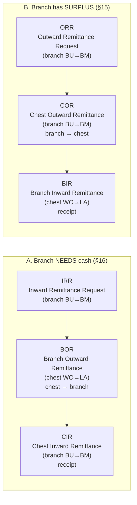

| Step | Screen | Recorded at | Cash direction | Points back to |
|---|---|---|---|---|
| A1 | Inward Remittance Request (IRR) | Branch | none | — |
| A2 | Branch Outward Remittance (BOR) | Chest | chest → branch | IRR |
| A3 | Chest Inward Remittance (CIR) | Branch | (receipt) | BOR |
| B1 | Outward Remittance Request (ORR) | Branch | none | — |
| B2 | Chest Outward Remittance (COR) | Branch | branch → chest | ORR |
| B3 | Branch Inward Remittance (BIR) | Chest | (receipt) | COR |

Other pairs: *Inter Branch Remittance ↔ Inter Branch Receipt*; *ATM Remittance Order ↔ ATM Outward Remittance*; *Excess Cash Delivery ↔ Branch Inward Remittance (type ACMC)*; *Diversion Order ↔ Diversion Outward/Inward Remittance*; *Soiled Remittance Order ↔ Soiled Notes Remittance*; *Fresh Currency Indent ↔ Fresh Currency Receipt*. The **BOR/BIR with Branch Type = Other** are for other-bank branches (no request/receipt pair at the branch side).

### 14.4 Note on the brief's naming

The brief's §9 asks to explain *"Branch Inward Remittance — why would a branch need cash?"* and §10 *"Branch Outward Remittance — why a branch sends cash to a chest"*. In the application those two *scenarios* exist, but are carried by the screens above: "branch needs cash" = **IRR → BOR → CIR** (§16 here), and "branch sends surplus" = **ORR → COR → BIR** (§15 here). §15 and §16 below keep the brief's *scenarios* but use the application's *screen names*.


---

## 15. Branch → Chest: sending surplus cash to the chest
### (screens: Outward Remittance Request → Chest Outward Remittance → **Branch Inward Remittance**)

### 15.1 What the words mean

* **Outward Remittance Request (ORR)** — the branch tells its chest: *"I have cash to send you; please arrange collection"* (or *"my own staff will bring it"*).
* **Chest Outward Remittance (COR)** — the branch records *the actual dispatch* (vehicle, agency, custodians, notes by denomination).
* **Branch Inward Remittance (BIR)** — the **chest** records *the receipt* of that cash, counts it, and notes any difference. In the application the word *"inward"* is from the **chest's** viewpoint: cash coming **in** from a branch.

**Why it exists.** Branches receive more cash than they need (customer deposits) or hold notes they should not re-issue. That cash has to go back to the chest, which is the bank's controlled stockpoint. **[DOMAIN + APP]** The trigger is *business judgement by the branch manager*; there is no branch retention limit in CCMS (§5.4). **[APP — absence]**

**Who initiates / approves.** Branch User prepares (`BU`); Branch Manager approves (`BM`). At the chest, chest staff (`WO`/`BO`) prepare the receipt; the Local Administrator (`LA`) approves. **[APP]**

### 15.2 Step by step

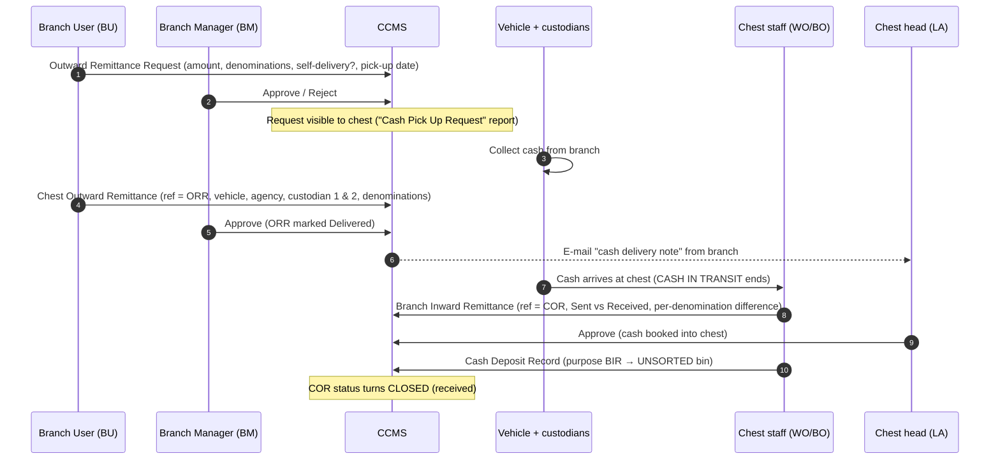

**Before** the transaction: the branch has surplus; the chest has (or plans) a vehicle trip (*Vehicles Trip Scheduling*, plan type *Own Branches*).
**During:** cash is counted at the branch and handed to the crew; CCMS holds the COR in status *OPEN* (approved but not yet received).
**After:** the chest counts, enters the **Received Amount**; CCMS shows **Sent / Received / Difference**; the cash is placed in an **unsorted bin** (§21–22).

### 15.3 What CCMS checks / does (from checked-in SQL and code) **[APP]**

* COR is saved *OPEN*. When a **new** COR is created for a branch, any **older COR of that branch that is still un-approved and un-received is auto-cancelled**.
* On COR **approval**: the referenced ORR is set `IsDelivered='YES'` and linked to the COR; on **rejection or cancellation**: the ORR becomes `IsDelivered='CANCEL'`, `Status='CANCEL'` (a new ORR is needed).
* A COR can be **cancelled only while no BIR (approved or pending) refers to it** (the grid computes `CanCancel`).
* At the chest, several branches' cash carried by one vehicle can be received in **one approval** (`BirIDs` = list of IDs).
* Branch Type on the BIR decides the form: *Own* / *CPC* (grid has category split) / *Other* (bank + branch + commission) / *ACMC* (references an Excess Cash Delivery, §32).

### 15.4 Other-bank branches and commission **[APP]**

For **Branch Type = Other Bank / DSB** the chest bank receives cash on behalf of another bank's branch. The BIR has **no COR reference**; you pick *Bank Name → Other Branch Name*, enter a vehicle number as text, and the app calculates **Commission** per denomination from the chest's parameter **"Commission Rate Per 1000 Pieces (INR)"**. The record is saved with `CommissionStatus = 'UnPaid'`, `IsCommisionReceived = 'No'`.
Later:

1. **Commission Bill Generation** — choose a bank, a *From/To date*, and generate a bill from the matching BIRs (grid per BIR: denomination, class, quantity, rate, amount → *Total Bill Amount*).
2. **Commission Bill Receipt** — record the money received against that bill (*Bill Amount* vs *Received Amount*).

Related: *Commission Voucher Client Branch* (`BTS`) records a branch-level commission voucher (description, bill no., amount) — **exact business use [UNCLEAR]**.

### 15.5 Worked example (illustrative numbers)

Pune Branch holds ₹15,00,000 it does not want to keep.

1. `BU` raises an **ORR** for ₹15,00,000 made up as follows:

| Denomination | Bundles (100 notes) | Notes | Amount |
|---|---|---|---|
| ₹500 | 20 | 2,000 | ₹10,00,000 |
| ₹200 | 10 | 1,000 | ₹2,00,000 |
| ₹100 | 30 | 3,000 | ₹3,00,000 |
| **Total** | | | **₹15,00,000** |

2. `BM` approves. The chest schedules a van; two custodians go along.
3. `BU` records the **COR** (ref = ORR, vehicle MH-12-AB-1234, custodians A & B); `BM` approves. ORR → *Delivered*.
4. At the chest the crew hands over. `WO` records the **BIR**: *Sent* ₹15,00,000 (from the COR), *Received* ₹14,99,000 (10 notes of ₹100 missing → **difference ₹1,000 short**), remark entered.
5. `LA` approves. COR → *CLOSED*. The chest deposits the cash into an **unsorted** bin. The ₹1,000 difference goes to §24 (debit note to Pune Branch after verification).

---

## 16. Chest → Branch: giving cash to a branch
### (screens: Inward Remittance Request → **Branch Outward Remittance** → Chest Inward Remittance)

### 16.1 What the words mean

* **Inward Remittance Request (IRR)** — the branch says *"I need this much cash (by denomination) for date D."* ("Inward" — cash coming **in** to the branch.)
* **Branch Outward Remittance (BOR)** — the **chest** prepares and dispatches the cash. ("Outward" from the chest's viewpoint.) Fields: **Requested Amount**, **Delivered Amount**, **Difference Amount**.
* **Chest Inward Remittance (CIR)** — the branch records **receipt** (fields **Sent Amount**, **Received Amount**, **Difference Amount**).

**Why it exists.** Customers withdraw cash and ATMs need loading; a branch's own stock runs low, so it draws from the chest.

**Who initiates / approves.** `BU` raises → `BM` approves the request. The chest's `WO`/`BO` prepare the BOR → `LA` approves. `BU`/`BM` record the CIR. **[APP]**

### 16.2 Step by step

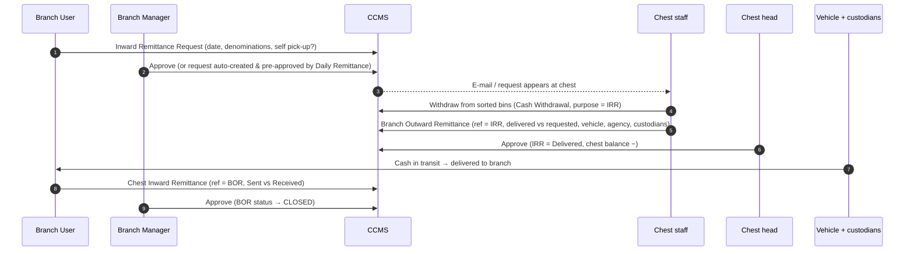

**Before:** the branch has estimated demand; the chest checks stock ("Cash Withdrawal for Outward Remittances" shows **Stock vs Demand → Difference → Supply** per denomination and *Adjustment(s)*; the message *"You have enough balance. No adjustment required"* appears when stock suffices). **[APP]**
**During:** the chest prepares the cash, the vehicle trip is scheduled (branches near each other are grouped — *Proximity Group*), custodians travel with the cash.
**After:** the branch counts and records what it received.

### 16.3 What CCMS checks / does **[APP]** (from `BSS_BranchOutwardRemittanceMaster_Upsert`)

* If the IRR was **already served** → `REQUESTALREADYSERVED` (no duplicate delivery).
* The BOR row is created with *Status = OPEN*, and `IsApprove = NULL` until the checker acts.
* **On approval:** the IRR is marked `IsDelivered='YES'` and stamped with the BOR id; the trip-schedule is flagged *outward done*; pending *adjustment plans* for that chest are cleared; for each detail line the balance log is called with title **`DELIVERY_NOTE`**.
* **On cancellation** of an approved BOR: the IRR is reset to `IsDelivered='NO'`, `Status='CANCEL'`, and the balance-log procedure is called again with the cancel flag (presumably reversing the movement — the procedure body is not in the repository). **[INFERRED]**
* **Delivered may differ from requested** (a denomination might not be in stock); the difference is shown per branch request.
* One BOR approval may cover **several branches of one proximity group** (`BorIDs`).
* Validations (screen messages): *Transaction Multiples Of (INR)*, *Min/Max Amount per Transaction*, *Insufficient Stock*, *Request Date must not be Past Date*, *Selected date is holiday, select next date*, *Quantity of all denominations must be whole numbers for an IRR*. **[APP]**

### 16.4 Worked example — "Branch A needs ₹20 lakh" (illustrative)

1. **Monday:** Kothrud Branch's `BU` raises an IRR for Tuesday: ₹20,00,000 (₹500: 30 bundles = ₹15,00,000; ₹100: 50 bundles = ₹5,00,000). `BM` approves.
2. **Tuesday morning, chest:** stock is fine. `WO` withdraws from the sorted bins and prepares a BOR: delivered = requested. Van + two custodians. `LA` approves → IRR *Delivered*.
3. **Cash in transit** while the van drives.
4. **Branch:** `BU` records the CIR: *Sent* ₹20,00,000, *Received* ₹20,00,000, difference 0. `BM` approves → BOR *CLOSED*.
5. If the branch had counted ₹19,90,000 the CIR shows a **₹10,000 difference** (branch remark), which triggers the discrepancy path (§24).

---

## 17. RBI Fresh Currency
### (screens: Fresh Currency Indent → *(RBI)* → Fresh Currency Receipt)

* **Fresh currency — simple meaning:** newly issued notes.
* **Why a chest needs it:** the chest's stock of *issuable* notes falls as it supplies branches/ATMs; RBI is the only source of fresh notes. **[DOMAIN]**
* **Fresh Currency Indent (FCI)** — the chest's **formal demand** to RBI for a stated amount by denomination. Fields: *Linked RBI Location*, *Self Pick Up?*, *Date*, *Counter Payment?* (+ *Counter Branch Name*), *Total Amount*, denomination grid, *Reason For Reject*. A parameter **"Indent Cut Off Time"** exists in Configurable Parameters. **[APP]**
  *Why "indent"?* — an *indent* is the traditional Indian term for a formal requisition for goods to be supplied, so the screen is literally "requisition for fresh currency". **[DOMAIN]**
* **Who creates:** chest staff; `LA` approves. **[APP]**
* **RBI / Mint:** RBI supplies the notes; the receipt has a checkbox **"Cash Received From Mint"** to mark when the source was a Mint (currency printing press) rather than an RBI office. **[APP flag; meaning DOMAIN]**
* **Remittance Order** — the document number/date RBI gives for the supply (*Remittance Order No*, *Remittance Order Date* on the receipt), and **RBI Challan / Challan Date** (fields in the model). **[APP]**
* **Fresh Currency Receipt (FCR)** — the chest records what actually arrived: *Reference Transaction ID* (the FCI), order no/date, *Self Pick Up?* or agency + vehicle, denomination × quantity × category, *Total*, *Discrepancy amount*. **[APP]**
* **Incentive on receipt:** the receipt screen shows **"Incentive Details"** — *Rate of Incentive* per denomination and *Incentive Amount*, computed from **RBI Incentive Rules** (§28), and flags `IsIncentiveClaimed` / `IncentiveClaimID`. **[APP]**
* **How the cash enters inventory:** after `LA` approval the chest records a **Cash Deposit** with purpose **"Fresh Currency Receipt"** (*Transaction Type = Sorted*): cash goes straight into **sorted** bins (fresh notes need no sorting). **[APP]**
* **After:** stock is available for IRR/ATM supply; the **Fresh Currency Indent vs Receipt** report compares demanded vs received; the incentive is later claimed (§28).

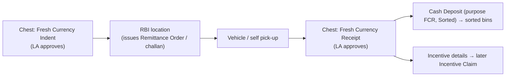

**Example (illustrative).** Pune Chest indents ₹5 crore (₹500 × 100,000 notes). RBI supplies against Remittance Order 145/2026. The chest's van collects it. `WO` records the receipt: ₹5,00,00,000, no difference. `LA` approves; cash is deposited into ₹500-fresh bins; the incentive line (rate × pieces) is stored for the month's claim.

---

## 18. RBI Soiled Currency
### (screens: Soiled Remittance Order → Soiled Notes Remittance → Incentive Claim → Incentive Receipt)

* **Soiled currency — simple meaning:** genuine notes too dirty/worn to be re-issued. **[DOMAIN]** In CCMS it is a *stock category* (**"Soiled Notes"**) and the subject of a remittance. **[APP]**
* **Why it is separated:** issuing soiled notes to customers/ATMs is not allowed; sorting therefore diverts them into their own bins. **[DOMAIN + APP]**
* **Why it goes to RBI:** only RBI can withdraw them from circulation (and credits the bank). **[DOMAIN]**
* **RBI Soiled Remittance Order (SRO)** — RBI's *instruction* to remit soiled notes. Captured fields: *RBI Location, Remittance Order No., Document Date, Delivery Date, Category, Self Vehicle?, Maximum Amount (INR)*; flags for *withdrawal planned*, *duty planned*, *reminder*. **[APP]**
* **Chest Soiled Notes Remittance (SNR)** — the chest's **actual dispatch** to RBI: *Reference Transaction ID* (the SRO), *Remittance Order No/Date*, *Category*, *Self-Vehicle?* or *CIT agency + vehicle*, *Requested / Delivered / Difference Amount*, denomination grid, checkbox **"Cash Sent to Mint"**, **incentive details**, and after approval an **API Tran ID/Status/Date** (result of a posting to Finacle). **[APP]**
* **Category** includes an **"Adjudicated"** category (mutilated notes sent to RBI to have their value decided — see §23). **[APP name; meaning DOMAIN]**
* **Incentive / incentive claim:** RBI pays the chest bank an incentive for handling soiled (and fresh/adjudicated) notes; the SNR computes the incentive lines; **RBI Incentive Claim Generation** rolls them up over a *From/To date* into a claim; **RBI Incentive Claim Receipt** records what RBI actually paid. §28.
* **Who does it:** chest staff prepare, `LA` approves; the sequence consumes cash from bins with a **Cash Withdrawal (purpose = Soiled Remittance Order)**. **[APP]**
* **How the process ends** in the application: the SNR is approved and *delivered*; incentives are claimed and received. What RBI does on its side (verification, credit to the bank's account, any short-acceptance) is **not documented in the application**. **[NOT DOCUMENTED]**

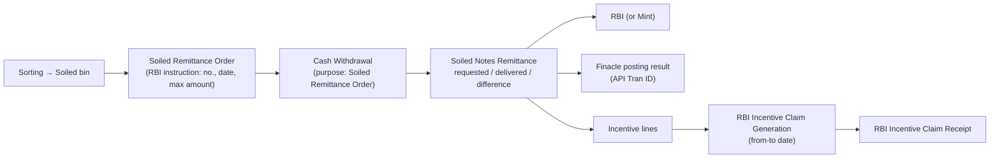

**Example (illustrative).** RBI orders soiled notes up to ₹2 crore by 30-Sep. The chest withdraws ₹1,99,00,000 from soiled bins; `WO` records the SNR (Requested ₹2,00,00,000, Delivered ₹1,99,00,000, Difference ₹1,00,000 — *"maximum amount"* allows less). `LA` approves. Incentive lines accrue. At month end the chest generates the claim; when RBI pays, the receipt is entered.

---

## 19. RBI Diversion
### (screens: RBI Diversion Order → Diversion Outward Remittance / Diversion Inward Remittance)

* **Diversion — simple meaning:** redirecting currency so that it goes to a different place from the usual one. **CCMS meaning:** an **RBI instruction that one chest send currency to another chest** (possibly another bank's), or expect it from one. **[APP; the RBI rationale is DOMAIN]**
* **Why RBI does it:** to rebalance the currency supply between regions/chests — one chest is over-stocked, another short. **[DOMAIN]**
* **RBI Diversion Order (RDO)** fields **[APP]:**

| Field | Meaning |
|---|---|
| *Diversion Type* | **Outward** (this chest must send) or **Inward** (this chest will receive) |
| *Diversion Order No* / *Order Date* | RBI's reference (order date must be today or past) |
| *Validity Till Date* | last valid date (must be today or future) |
| *Bank* + *Deliver to Chest* | the counterparty bank and chest |
| *Amount INR* | total ordered |
| *Self-Vehicle?* | own staff carry it |
| *Remaining Amount*, *Status* | balance not yet fulfilled; OPEN / CLOSED |

* **Diversion Outward Remittance** — at the **sending chest**: *Reference = RDO*, *Ordered/Remaining Amount*, *Delivered Amount*, *Difference*, agency, vehicle, custodians. `WO` prepares, `LA` approves. **[APP]**
* **Diversion Inward Remittance** — at the **receiving chest**: *Ordered/Remaining Amount*, *Received Amount*, *Difference*. On approval the receipt is logged (**`RECEIPT_NOTE`**), and a notification "To CA On Diversion Inward Remittance" exists. The cash is deposited into **sorted** bins (Deposit purpose "Diversion Inward"). **[APP]**

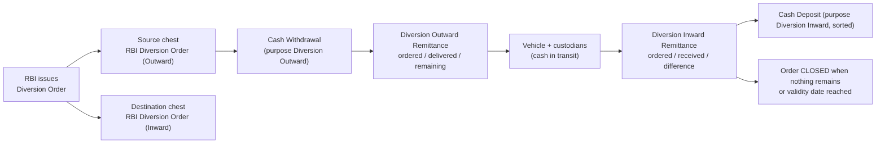

### 19.1 Rules visible in the checked-in SQL **[APP]**

* An order can be fulfilled in **parts**: the order keeps a **Pending Amount**; the order stays **OPEN** while `PendingAmount > 0`. It becomes **CLOSED** when nothing is pending **and the approver is `LA`** (a non-`LA` save leaves it OPEN).
* All orders whose **validity date is today or earlier are automatically set to CLOSED** whenever a diversion remittance is processed.
* If the sum of all approved lines already covers the order total, further attempts return `REQUESTALREADYSERVED`.
* Reports: *Chestwise Open And Closed Diversion Orders Report*, *Diversion Remittances Summary*.

**Example (illustrative).** RBI orders Pune Chest to send ₹10 crore to Nashik Chest within 10 days. Pune enters an *Outward* RDO (₹10 cr, valid till the 10th). Nashik enters an *Inward* RDO. On day 2 Pune sends ₹6 cr (Pending ₹4 cr, order OPEN); on day 5 the remaining ₹4 cr (Pending 0, closed on `LA` approval). Nashik records receipts of ₹6 cr and ₹4 cr; if it counts ₹3,99,90,000 in the second one, that ₹10,000 difference is a discrepancy.

---

## 20. Chest ↔ Chest Movement

* In CCMS **the only way one chest sends currency to another chest is the RBI Diversion Order flow** (§19). There is **no free-form "chest-to-chest transfer" screen**. **[APP — absence]**
* **Diversion vs normal chest transfer:** a normal transfer would be initiated by the banks themselves; a diversion is **initiated by RBI's order**, has an **order number, order date and validity**, is **partially fulfillable**, and is tracked as an **order** with remaining amount. **[APP + DOMAIN]**
* *Inter-Branch* transactions (§33) can involve another bank's branch, but they are *branch-level* transfers, not RBI-ordered chest diversions.

---

## 21. Bins, Cabinets and Workstations — the physical storage model

### 21.1 The objects

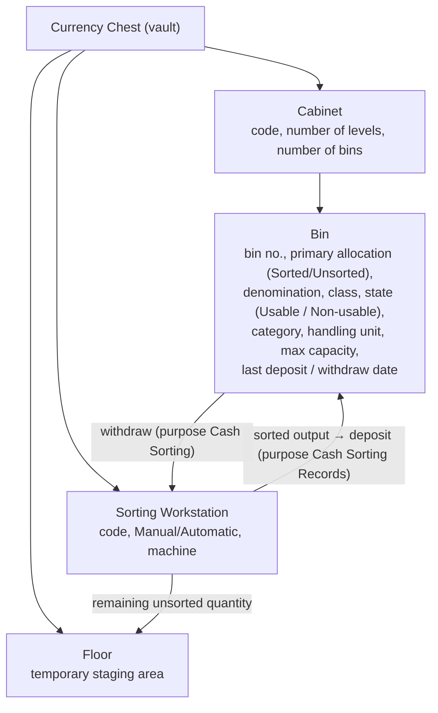

* **Cabinet — what is it physically?** A steel storage unit inside the vault with several shelves ("levels") and compartments. In CCMS: *Cabinets Master* with *Cabinet Code*, *Number of Levels*, *Number of Bins*. **[APP]** (physical description **[DOMAIN]**)
* **Bin — what is it physically?** One compartment holding **one denomination in one condition**. In CCMS: *Bins Master* with *Primary Allocation*, *Denomination Allocation (value/class)*, *Currency State*, *Currency Category*, *Handling Unit*, *Accommodation (max storage) Capacity*. Capacity is checked (*"Bin Capacity Exceeds"*). **[APP]**
* **Workstation — what is it physically?** A note-sorting machine (or manual sorting table) — *Currency Sorting Workstation*: code, **Operation Type (Manual / Automatic)**, machine description, plus counters (number of withdrawals, total machine quantity). **[APP]**
* **Floor:** cash that is out of bins and not on a workstation (e.g., the remainder after sorting). Reports include *Floor Balances* and *Cash On Floor*; the message *"Report cannot be viewed! Floor and Workstation Balance must be 0"* shows the day-end expectation. **[APP]**
* **Sorted / Unsorted (primary allocation):** an **Unsorted** bin holds raw cash as received from branches; a **Sorted** bin holds graded cash ready to issue. **[APP]** (§22)

### 21.2 How stock gets in and out

* **Bins Opening Balances** — the *declared opening quantity* per bin when the chest starts using CCMS (a one-time transaction; "Opening balance is already assigned to this bin. Can't give again."). **[APP]**
* **Cash Deposit Records** — putting cash **into** bins. *Purposes:* Branch Inward Remittance (→ Unsorted), Diversion Inward (Sorted), Fresh Currency Receipt (Sorted), Cash Sorting Records (Sorted), Bin Shifting, Other. **"Run Dynamic Deposit Plan / Show Plan"** proposes bins; the app warns *"No space available for following denomination(s)"*. **[APP]**
* **Cash Withdrawal Records** — taking cash **out of** bins. *Purposes:* Inward Remittance Request, Diversion Outward, ATM Remittance Order, Soiled Remittance Order, Bin Shifting, Cash Sorting (Unsorted/Both), Other. **"Run Dynamic Withdrawal Plan"**; warnings *"Insufficient Stock in Bin / Workstation / Floor"*. **[APP]**
* **Bin Shifting** = withdraw from one bin and deposit into another (moving stock within the vault). **[INFERRED]**
* **Bin Aging Report** shows stock and *pending stock since* a date per bin; **Cash In Bins** shows present units per bin. **[APP]**

**Why bins exist.** For control: every bundle has an address, so a physical count can be matched with the book balance; capacity limits and aging highlight stock that is stuck.

---

## 22. Currency Sorting Flow

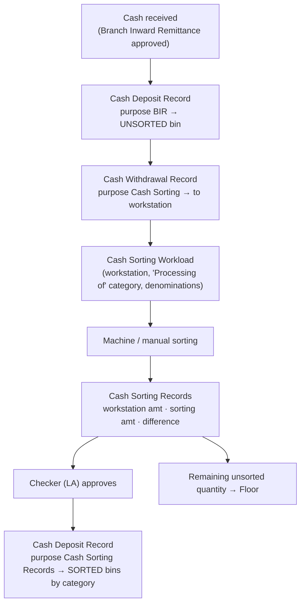

**What happens at each stage** **[APP]**

1. **Cash received** — after the BIR is approved, cash is physically at the chest.
2. **Unsorted bin** — a deposit record (*Transaction Type = Unsorted*) puts it in an unsorted bin.
3. **Sorting workload** — the *Cash Sorting Workload* screen plans what will be processed on which workstation (*Processing of* a category; denomination, quantity, amount).
4. **Sorting workstation** — cash is withdrawn from unsorted bins to the workstation (Withdrawal purpose *Cash Sorting*).
5. **Currency sorting** — the machine (or staff) separates the notes by quality.
6. **Sorting record** — *Cash Sorting Records* stores: **Workstation Code**, **Workstation Amount** (what was loaded), **Sorting Amount** (what was sorted out), **Difference Amount**, and *"Remaining Unsorted Quantity Transfer to Floor"*.
7. **Checker verification** — `LA` approves or rejects (*Reason For Reject*).
8. **Sorted bin** — the outputs are deposited (purpose *Cash Sorting Records*, Sorted) into bins by category.

**Quantities:** *denomination* (which note), *quantity* (in handling units — bundles), *amount* (₹ = value × count-per-unit × units). **Workstation amount vs sorting amount** = input vs output; **difference** = input − output → **shortage** if positive, **excess** if negative. **[APP + arithmetic]**

**Reports:** *Currency Notes Sorting Summary*, *Processing Output Report* (columns *Cash Out For Processing (Bundle)* · *Fresh* · *Issuable* · *ATM* · *Soil* · *Unsorted* · *Return* · *Cash Sent To Vault* · *Differences*).

**Example (illustrative).** ₹10,00,000 of ₹500 notes are loaded on WS-01. Output: Fresh ₹1,00,000, Issuable ₹7,50,000, ATM-fit ₹1,00,000, Soiled ₹49,000 = ₹9,99,000 → **Difference ₹1,000 shortage** (2 notes of ₹500), which must be explained/recorded before the checker approves.

---

## 23. Currency Categories — usable, soiled, mutilated, fake

These are **not interchangeable**. **[DOMAIN + APP]**

| Category | Is it genuine? | Usable? | What CCMS does | Where it goes |
|---|---|---|---|---|
| **Fresh** | yes | yes | *Fresh Currency Receipt*; incentive-bearing | Sorted "Fresh" bins → branches/ATMs |
| **Issuable / ATM-fit** | yes | yes | Bin categories *Issuable Notes*, *ATM Fit Notes* (SQL literals) | Branch (IRR) / ATM (ARO) supply |
| **Soiled** | yes | no (worn) | Category *Soiled Notes*; *Soiled Remittance Order/Notes Remittance* | RBI |
| **Sticky** | yes | no (needs separate handling) | Category *Sticky Notes* in the quality report | **[NOT DOCUMENTED]** beyond the report |
| **Mutilated** | yes but damaged (torn/incomplete) | no | *Branch Debit Note* types: **Mutilated (Full / Half / NIL value)**; *Soiled Notes Remittance* category **Adjudicated**; Finacle message "MutilatedNotes Handed Over to RBI" | RBI, for value determination ("adjudication") |
| **Fake / counterfeit** | **no** | no | *Fake Currency Note Records* (serial number, reason of suspicion, RBI jurisdiction, source branch/source type Internal/External, ≤20 KB image); debit-note type **Fake**; Finacle message *FakeNote*; RBI *Penalty* type *Fake Note* | Impounded; reporting to RBI/police **[NOT DOCUMENTED]** |
| **Un-processed / Unsorted** | unknown | unknown | Not yet sorted | Unsorted bins → sorting |
| **Coins** (Current / Uncurrent) | yes | current = usable | Denomination class *Coins*; *Small Coin* flag; *Coins End Of Day Chest Slip* | Coin bins |

**Half / NIL / Full value (mutilated notes).** The debit note stores *how much the note is worth*: **Full value** → 1 × face value; **Half value** → ½ face value; **NIL value** → 0 (screen logic in `BranchDebitNote.aspx.cs`, `CalculateTotalQuantityAmount`). **[APP]** These correspond to RBI's rules for paying for damaged notes; the rule itself is **[DOMAIN]**.

**Not documented in the application:** the complete physical flow for **sticky** notes and the **post-impound flow for fake notes** (police report, RBI reporting). Both are called out as *not documented*.

---

## 24. Shortage, Excess and Discrepancies

### 24.1 Definitions

* **Discrepancy** — any mismatch between what one party says it sent (or expected) and what the other counted.
* **Shortage** — received **less** than expected. *Example:* expected ₹10,00,000, received ₹9,99,000 → **₹1,000 shortage**.
* **Excess** — received **more** than expected. *Example:* expected ₹10,00,000, received ₹10,01,000 → **₹1,000 excess**.

### 24.2 Where discrepancies are captured **[APP]**

| Place | Fields |
|---|---|
| Branch Outward Remittance / Chest Inward Remittance | Requested vs Delivered vs Difference / Sent vs Received vs Difference |
| Branch Inward Remittance | Sent vs Received vs Difference (+ per-denomination *Discrepancy*), *Branch Remark* |
| Inter Branch Receipt | Requested/Delivered vs Received vs Difference |
| Diversion Outward / Inward | Ordered/Remaining vs Delivered/Received vs Difference |
| Soiled Notes Remittance | Requested vs Delivered vs Difference |
| Fresh Currency Receipt | *Discrepancy amount* |
| Cash Sorting Records | Workstation vs Sorting vs Difference |
| Control Sheet | Chest slip vs bins + workstation + floor → *Difference* |
| **Discrepancies Report** | Shortage, Fake, Full Value, Half Value, Zero Value, Total Quantity, Total Amount, Excess Quantity |

### 24.3 How the money side is handled **[APP]**

* **Branch Debit Note** (`AFS`) — the chest *debits the branch* for a verified loss: **Discrepancy Type** = *Shortage Quantity* · *Fake Quantity* · *Mutilated (Full / Half / NIL value)*; branch code/IFSC/name; denomination; **Date of Detection**; **Note Serial Number** (3 letters + 6 digits, for individual fake/mutilated notes); attachment (`.pdf/.jpeg/.png/.docx/.doc`); remarks. `LA` approves. After approval the app posts an accounting entry through the **Finacle** gateway (`XferTrnAdd`); the *Finacle Integration Details* screen (visible to `CA`/`HU`) lists each attempt: *Request UUID, API Status, failure reason, Maker ID, Verifier ID, verification date/time*.
* **Branch Credit Note** — the opposite: **excess** cash found is credited to the branch (*Excess Quantity × denomination = Credit Amount*).
* **GL accounts at a business level:** the branch master carries the bank's account numbers used for each situation — *Shortage Account*, *Excess Cash Account*, *Fake Note Account*, *Mutilated Note / Loss on Mutilated Note Accounts*, *Mutilated Note Submitted to RBI Account*, *RBI Mirror Account*, *Intermediate Account*, *Processing Branch Account*, *Cash In Transit Account*. Postings use them so the ledgers show **who owns the loss** until it is resolved. **[APP labels; accounting interpretation INFERRED]**
* **Penalties (RBI-side):** if RBI itself finds fake / re-issuable / shortage / mutilated notes in the chest's remittance, it can penalise the chest bank (§29).

**Why it matters.** Operationally, each unexplained rupee breaks the chain of custody and blocks the receipt's closure; financially, the loss must be booked to the right account and, if possible, recovered from the responsible branch.

**Example — the ₹10,00,000 vs ₹9,98,000 case (Scenario 6, §38).** The *BIR* shows *Sent* ₹10,00,000, *Received* ₹9,98,000, *Difference* ₹2,000 (per-denomination *Discrepancy* shows 4 notes of ₹500 missing); the chest raises a **Debit Note (Shortage, 4 × ₹500 = ₹2,000)** against the sending branch, `LA` approves, and a Finacle posting is made.

---

## 25. Cash in Transit

* **Cash in Transit** — cash that has **left one location and has not yet been received at the next** (e.g., in the van). **[DOMAIN]**
* **In CCMS** it appears as:
  * a report *"Cash In Transit"* (`MIS_CashInTransitReport`);
  * a GL account *"Cash In Transit Account Number"* on the branch master;
  * an implied **state**: an *approved* dispatch (BOR/COR/AOR/…, `Status='OPEN'`, `IsReceived = No`) whose matching receipt (CIR/BIR/…) has not been recorded yet. **[INFERRED from the status logic in SQL; the exact composition of the report is in a procedure not in the repository]**
* **It is not "cash physically sitting inside the chest".** After dispatch, the sender's stock is reduced (approved BOR logs `DELIVERY_NOTE`), but the receiver's stock does not increase until the receipt is approved (`RECEIPT_NOTE`). The gap between the two is the cash in transit. **[INFERRED — matches the two-phase logging seen in the checked-in procedures]**

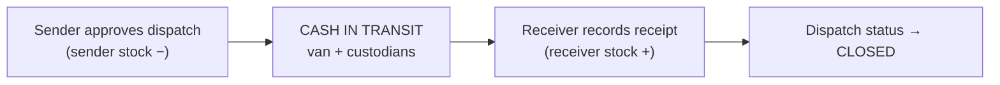

---

## 26. Maker / Checker
See **§10.3** for the full explanation. Where it appears in CCMS:

* every chest transaction (`WO`/`BO` → `LA`),
* every branch transaction (`BU` → `BM`),
* ATM cell (`AU` → `AH`),
* debit/credit notes, sorting, deposits/withdrawals, RBI transactions, petty cash (has `IsApprove`), etc.,
* the *Finacle log* stores *Maker ID* and *Verifier ID* for postings.

Two exceptions: **Daily Remittance**-generated requests are pre-approved; **reversal** screens are performed by the role that owns the original side (`LA` at the chest; `BM` at the branch).

---

## 27. Status Lifecycle

### 27.1 Two (really three) status dimensions **[APP]**

| Dimension | Values | Meaning |
|---|---|---|
| **Checker** (the "Checker" column) | **Pending** (`IsApprove` NULL) · **Approved** (1) · **Rejected** (0) · **Cancelled** (approved then cancelled) | Has the maker's entry been authorised? |
| **Status** (overall; a.k.a. "Status" / "Is Received?") | **OPEN** · **PENDING** (enum only) · **CLOSED** · **CANCELLED** · **REVERSED** | Where is the business event? |
| **IsDelivered** (on requests: IRR, ORR, ATM order) | **YES · NO · CANCEL** | Has the request been served? |
| **IsReceived** (on dispatches: BOR, COR, …) | received / not received | Has the counterparty confirmed arrival? |

Why several dimensions? Because *authorisation* (Checker) and *physical progress* (Status) are independent: a dispatch can be **Approved** but still **OPEN** (in transit); a request can be **Pending** and not yet exist physically at all.

### 27.2 How the overall status is derived — chest→branch dispatch (BOR) **[APP]**

From the SQL in `2.SP_ALTER_GET.sql`:

| Condition | Status shown |
|---|---|
| received = yes | **CLOSED** |
| not received and `Status='REVERSED'` | **REVERSED** |
| rejected (`IsApprove=0`) or cancelled (`IsCancel=1`) | **CANCELLED** |
| otherwise | **OPEN** |

For the branch→chest dispatch (COR): *cancelled → CANCELLED; reversed & not received → REVERSED; not received → OPEN; else CLOSED.* For diversion orders: *OPEN / CLOSED* by remaining amount and validity (§19.1).

### 27.3 Lifecycle diagram (exact for dispatches; conceptual for the rest)

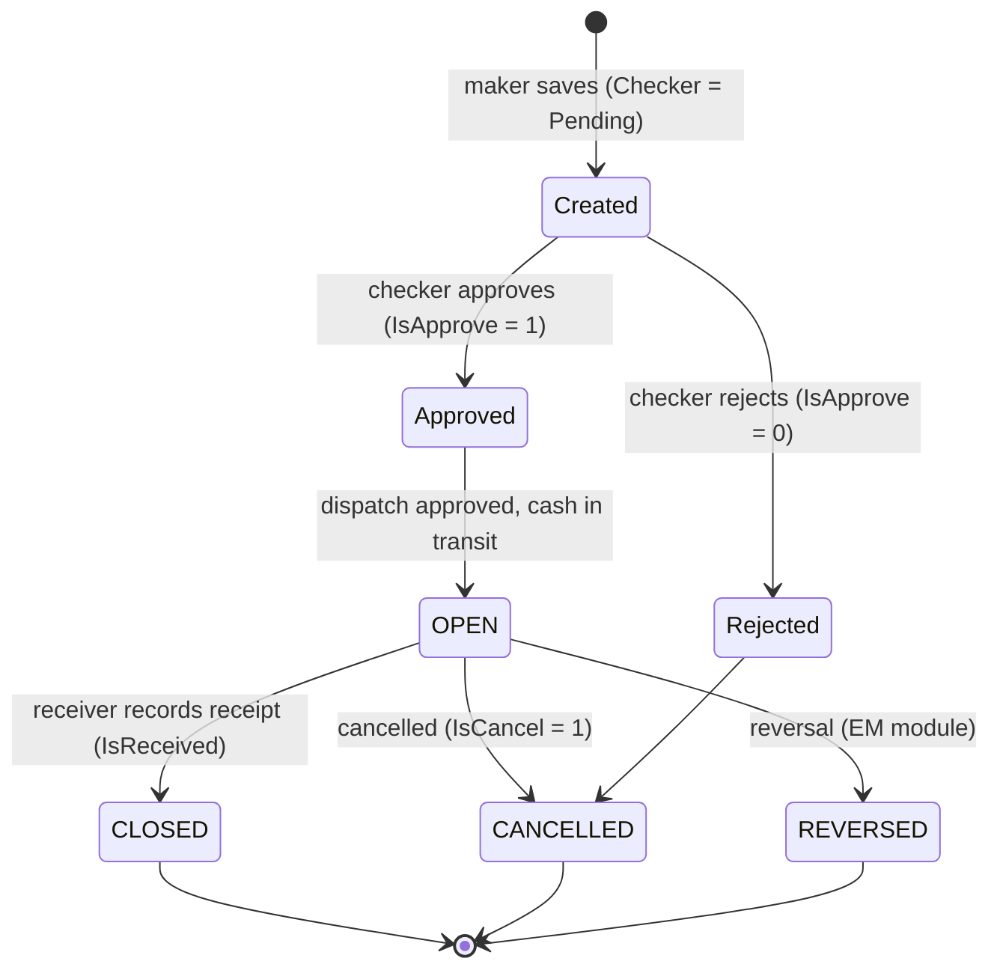

The extra intermediate steps in the brief's sample diagram ("Submitted", "Operational Processing", "Verification") are **not distinct states in the application**.


---

## 28. RBI Incentives

* **What is it?** Money **RBI pays the chest-holding bank** for certain handling work — in CCMS: for **fresh currency received**, **soiled notes remitted** and **adjudicated (mutilated) notes remitted**. **[APP]** (the *"Incentive For"* list in *RBI Incentive Rules* has exactly these three).
* **Why does it exist?** Operating a chest costs the bank effort and money; RBI compensates it through a tariff per note/bundle. **[DOMAIN]** The **actual RBI scheme** is *not* described in the application; CCMS only stores the *rates* it is told to use.
* **When does it arise?** At the moment a **Fresh Currency Receipt** or **Soiled Notes Remittance** is saved: the screen shows **Incentive Details** — *Denomination, Quantity, Rate of Incentive, Incentive Amount (INR)*. **[APP]**
* **The three steps:**

| Step | Screen | What happens |
|---|---|---|
| 1. Set the rates | **RBI Incentive Rules** | Per chest, choose *Incentive For* (Fresh Currency Receipt / Soiled Notes Remittance / Adjudicated Notes) and enter a rate per denomination. |
| 2. Claim | **RBI Incentive Claim Generation** | Choose *Incentive For*, *From Date*, *To Date*; the app lists the un-claimed receipt/remittance lines (`ReferenceFcrIDs`), totals them (*Total Claimed Amount*) and **Generate Bill**. The source receipt carries `IsIncentiveClaimed` / `IncentiveClaimID` fields so a line is not claimed twice **[APP fields; behaviour INFERRED]**. |
| 3. Receive | **RBI Incentive Claim Receipt** | Reference the claim; enter *Received Amount* against *Claimed Amount*. Any short-payment is visible as the difference. |

**Example (illustrative).** In September the chest receives fresh notes (incentive ₹X) and remits soiled notes (incentive ₹Y). On 1-Oct it generates a claim for 1–30 Sep = X+Y. RBI credits X+Y−Z; the receipt records ₹(X+Y−Z) received. **Not documented:** how RBI communicates the payment or how a short-payment is disputed. **[NOT DOCUMENTED]**

---

## 29. RBI Penalties

* **Why can a penalty occur?** When RBI examines currency the chest has remitted, it may find **fake notes**, **re-issuable (still-usable) notes wrongly sent as soiled**, **shortages** or **mutilated notes** and charge the bank. **[DOMAIN, matching the four categories in the application]**
* **RBI Penalty Rules** (`RFS/RBIPenaltyRules`) — per chest: **Penalty Against** (a named penalty type), and for each **denomination** a **Penalty For** (*Fake Note / Re-issuable Note / Shortage Note / Mutilated Note* — enum `PenaltyFor`) with a **Penalty Rate (INR)**. **[APP]**
* **RBI Penalty Record** (`RFS/RBIPenaltyRecords`) — a log of an actual penalty: **RBI Reference Number**, **Penalty Against**, **Date of Detection**, **RBI Debit Date** ("RIB Debit Date" on the form — typo), **Total Penalty Amount**, per-denomination grid, remarks. **[APP]**
* **Purpose:** keep an auditable record of what RBI debited, when and why, so the bank can reconcile the debit and (if the bank chooses) trace responsibility. Whether CCMS then *recovers* the penalty from a branch (e.g., via a debit note) is **not confirmed**. **[UNCLEAR]**

---

## 30. Reimbursements and Claimable Expenses

* **Reimbursement — simple meaning:** being repaid a cost you already paid.
* **Claimable Expense** — an expense **RBI has agreed to repay** (heads maintained in *Claimable Expenses Heads*). **[APP]**
* **Claimable Expenses Voucher** — the record of one such expense: *Expense Head, Description, Bill Number, Amount*, and a **Transaction Type** of either:
  * **"RBI Reimbursement"** (internal key `Adjudicated`) — referencing a **Branch Debit Note** (i.e., relates to mutilated/adjudicated notes), or
  * **"Claimable Expense Voucher"** (internal key `Soiled`) — referencing a **Soiled Notes Remittance**. **[APP]** (the mapping of these two labels to their business meaning is **[INFERRED]**)
  After approval the app also sends a Finacle posting whose sample file names read `…_CreditRecdfromRBI_…` (a *credit received from RBI*). **[APP]**
* **Reimbursement Receipt** — when RBI pays: *Claimable Expense Reference, Expense, Bill Amount, Received Amount*. **[APP]**
* **What does "CEV" represent?** The brief guessed *CEV*; **the abbreviation does not occur in the application**. The closest concept is the **Claimable Expenses Voucher** above. **[NOT CONFIRMED]**
* **Difference from an incentive:** an *incentive* is a **rate-based reward** for doing handling work; a *reimbursement* **repays actual bills**. **Difference from a penalty:** a penalty **takes money away** (RBI debits the bank).

**Example (illustrative).** The chest pays ₹4,500 for packing material for a soiled-notes remittance (Head: *Packing*). It saves a Claimable Expenses Voucher (bill 1234, ₹4,500), `LA` approves. RBI later reimburses ₹4,200; the Reimbursement Receipt shows Bill ₹4,500, Received ₹4,200.

---

## 31. Daily Remittance

* **Daily Remittance — simple meaning:** a *standing instruction* so a branch doesn't have to raise an IRR every day.
* **CCMS meaning:** the **Daily Remittance Request (DRR)** stores a **template**: *Branch, Self Pick Up?, denominations and total, Auto Send, From Date, To Date, Generation Time, Status (Active/Inactive)*. **[APP]**
* **Generation Time** — the time of day the request is generated; the drop-down offers 18:00, 18:30, 19:00, 19:30 and some afternoon test times. **[APP]**
* **What the scheduler does** (`BLL/Scheduler.cs`, method `SendDailyRemitanceRequest`) **[APP]**:
  1. reads all *Active* DRRs, passing the current time to the query (presumably to select those whose *Generation Time* is due — the filter itself is inside a stored procedure not in the repository; the explicit `time == GenerationTime` check in the C# is commented out) **[INFERRED]**;
  2. skips the run if today is a **holiday for that chest** (*Chest Holidays Calendar*, `USA/HolidaysMaster` → weekday / holiday? / frequency *Every*, *Every first and third*, *Every second and fourth*);
  3. if today falls between *From Date* and *To Date*, **creates an Inward Remittance Request** with the DRR's amounts, marked **"By Daily Remittence"** and **already approved** (`IsApprove = true`), and e-mails the chest head (`LA`);
  4. on the *To Date* (or the last working day before it, if *To Date* is a holiday) at 11:55 it sends an **expiry reminder** ("Mail On Expiry of Daily Remittance Request").
* **Why needed:** high-volume branches need the same cash every day; automating the request removes daily manual work and errors.
* **Holidays:** the calendar decides whether a request is generated and blocks holiday dates in manual requests ("Selected date is holiday, select next date").
* **Caveat:** in this repository **nothing calls `SendDailyRemitanceRequest`** — the timer wiring in `Scheduler.cs` is commented out, and `TaskScheduler.cs` has an empty timer handler. The trigger is therefore **outside the repository (e.g., an external job/service)**. **[UNCLEAR]**

---

## 32. ATM Remittance

### 32.1 The actors and words
* **ATM cell / ACMC** — a unit (a branch flagged *Is ACMC Branch?*) that manages ATM cash; users `AH` (ACMC Head) and `AU` (ACMC User). *Full form of ACMC not confirmed.* **[APP / UNCLEAR]**
* **Agency (category ACMC or CIT)** and **Custodian** — the vehicle and crew that carry the cash to/from the ATM cell. The order form's agency list is filtered to category **ACMC**. **[APP]**
* **ATM Cell Document Reference** — a mandatory free-text reference (with a reference date) that ties the CCMS record to the ATM cell's own document. **What that document is, is not explained.** **[UNCLEAR]**
* Only denominations flagged **"Used for ATM?"** in *Denominations Master* are relevant to ATM orders. **[APP]**

### 32.2 The flow

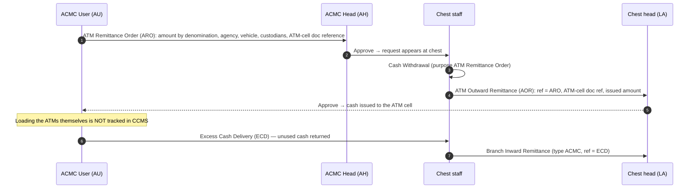

* **ATM Remittance Order** (`BTS`) — prepared by `AU`; role checks show `AH` (and `BM`) as approver; fields *Branch, Request To Chest, Date, ATM Cell Document Reference, Order Date, Agency, Vehicle, Custodian 1/2, Total Amount, denominations*; status *IS Delivered? / Status* (OPEN / CLOSED / CANCELLED, `ATMRemittanceOrderStatus`). (The page's form title says "Chest Inward Remittance" — a copy/paste label.) **[APP]**
* **ATM Outward Remittance** (`BSS`) — the chest's issue against an order: *Reference Transaction ID (ARO), ATM Cell Document Reference, Ref. Date, Agency, Vehicle, Custodian 1/2, Total Delivered Amount*; `LA` approves. **[APP]**
* **Excess Cash Delivery** (`BSS`) — the ATM cell **returns excess cash** to the chest: *Branch, Deliver To Chest, Agency, Vehicle, Custodian, Total Delivered Amount*, `AU` → `AH`. The chest receives it as a **Branch Inward Remittance of type ACMC**, referencing the ECD id. **[APP]**
* **Reports:** *ATM Remittance Order Register* (order vs AOR), *ATM Remittances Summary*.
* **Not documented / not invented:** how agencies are chosen for ATM orders beyond the category filter, what happens between the ATM cell and the actual ATMs, and whether ECD reflects ATM cassette returns. **[NOT DOCUMENTED]**

---

## 33. Inter-Branch Transactions

* **What it is:** cash sent **directly from one branch to another branch** (own or another bank's) without the chest being a party. Screens: **Inter Branch Remittance** (sender) → **Inter Branch Receipt** (receiver). **[APP]**
* **Fields:** Remittance — *Branch Type (Own / Other), Bank Name, State, District, Branch, Vehicle, Total Amount, denominations*; Receipt — *Reference (the remittance), Requested/Delivered Amount, Received Amount, Difference, Branch Type, Other Bank/Branch*. `BU` → `BM`. The label **"Chest Branch"** on those forms just shows the user's chest for context. **[APP]**
* **Why it exists (inferred):** to record cash lent between neighbouring branches (one short, one long) without a round-trip to the chest. **[INFERRED]**
* **How it differs from branch↔chest:** no request/dispatch/receipt chain through the chest; there is **no chest-side approval** and no bins are involved. **Whether it changes the chest's book balance is not confirmed** from the material available. **[UNCLEAR]**
* **Reports:** *Inter Branch Transactions Report* and *Summary* (State, City, Sender Bank/Branch, Sent, Remittance Amount, Receiver Bank/Branch, Received, Status).

---

## 34. Cancellation

* **Why required:** a request may become unnecessary (branch no longer needs cash), be a duplicate, or a dispatch may not go ahead.
* **Ways cancellation occurs** **[APP]**:
  1. **Request Cancellation screen** (`BSS/InwardOutwardRequestCancellation`) — choose *Transaction Type* (**Inward Remittance Request**, **Outward Remittance Request**, **ATM Remittance Order**), pick the *Request ID*, confirm *"Are you sure to cancel this request?"*, enter *Reason For Cancellation*. Grid shows *Cancellation Date, Status, Reason*. The permission to use it comes from the permission matrix (no hard-coded role check).
  2. **"Is Transaction Cancel?" checkbox** on IRR, ORR, BOR, COR forms (cancels that transaction).
  3. **Auto-cancel:** a *new* COR cancels the branch's older un-approved, un-received CORs.
  4. **Rejection** of a COR by the checker sets the referenced ORR to `CANCEL` (checked-in SQL); the same pattern for other pairs is **[INFERRED]**.
* **When possible:** only while the transaction has not been served; an already-served request returns **REQUESTALREADYSERVED**; a COR cannot be cancelled once a BIR refers to it.
* **What happens to the original:** it stays in the system with `IsCancel = 1`, status **CANCELLED**, and (for the request) `IsDelivered = 'NO'/'CANCEL'`; cancelling a BOR resets its IRR to *CANCEL*.
* **Why a new request may be needed:** a cancelled/rejected request is *dead*; if cash is still needed, a fresh request must be raised (and re-approved).
* **Report:** *Transaction Cancellation Report* (chest, branch, transaction type, ID, amount, cancellation date).

**Example.** Kothrud raised an IRR for ₹5 lakh by mistake, ₹50 lakh intended. Before the chest serves it, the request is cancelled with reason "wrong amount"; Kothrud raises a new IRR for ₹50 lakh.

---

## 35. Reversal

* **What reversal means:** **undoing an already-approved dispatch transaction** and leaving an audit trail, instead of deleting it. **[APP + DOMAIN]**
* **Screens** (module `EM`, "exception"): **Inward Reversal** (`LA` — reverses a **BOR**, i.e., a chest→branch dispatch; fields *BOR Number, BOR Transaction Date, Branch Name, Reversal Transaction ID/Date, Reversal Reason, Remark*) and **Outward Reversal** (`BM`/`BU` — reverses a **COR**, i.e., a branch→chest dispatch; *COR Number*…). (Both pages' form title says "Inward Reversal" — a label typo.) **[APP]**
* **Reasons:** chosen from a database-driven list (`ExceptionModule.ReversalReason`). **Values are not in the repository.**
* **What happens to the original:** its status becomes **REVERSED** (shown when the transaction was *not received*: `IsReceived = 0 AND Status = 'REVERSED'` in the grid logic). A reversed request can no longer be selected as a reference (the reference queries exclude `Status='REVERSED'`). **[APP]** The exact eligibility rules and the stock/balance effects live in stored procedures that are **not in the repository**. **[UNCLEAR]**
* **When "Branch Outward Reversal" is used:** the brief asks; in CCMS the closest match is **Outward Reversal (COR reversal)**: when a branch has recorded a dispatch to the chest that must be undone. **[INFERRED]**

### Cancellation vs Reversal (picture)

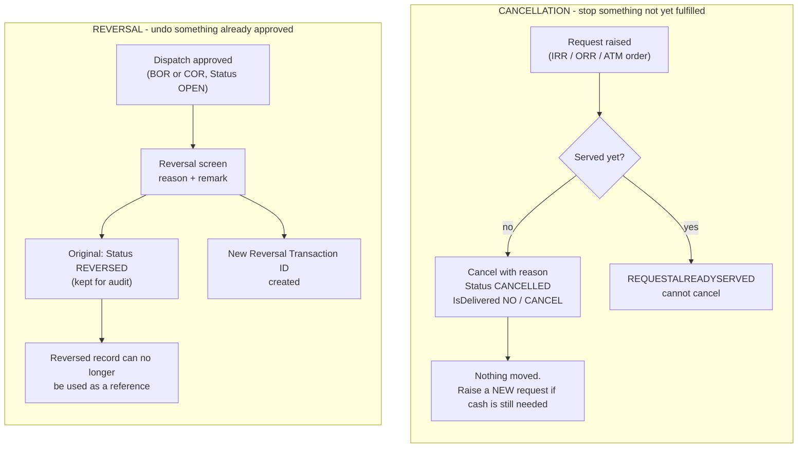

### Cancellation vs Reversal

| | **Cancellation** | **Reversal** |
|---|---|---|
| Purpose | Stop something that has not been fulfilled | Undo something already approved/booked |
| Typical target | IRR, ORR, ATM order; a not-yet-received BOR/COR | An approved BOR or COR (dispatch) |
| Screen | *Request Cancellation*; "Is Transaction Cancel?" checkbox | *Inward Reversal* / *Outward Reversal* |
| Who | Role granted by the permission matrix; branch/chest maker/checker | `LA` (inward), `BM`/`BU` (outward) |
| Needs a reason? | Yes ("Reason For Cancellation") | Yes ("Reversal Reason" + remark) |
| Status result | **CANCELLED** (+ `IsDelivered NO/CANCEL`) | **REVERSED** |
| Creates a new record? | No | **Yes** — a *Reversal Transaction ID* |
| Original stays visible? | Yes | Yes |
| Follow-up | Raise a fresh request | Re-do the transaction correctly if needed |

---

## 36. Charge Handover

* **What "charge" means:** *charge of the chest* — the responsibility for the vault, its cash and its keys. **[DOMAIN]**
* **Why it must be handed over:** when the person in charge changes (transfer, leave, retirement), an auditable record must show **who held the chest until when, and what cash it held at that moment**. **[DOMAIN + INFERRED]**
* **Charge Handover Screen** (`RFS`) **[APP]:** *Chest Name, Handover Date, Handover Time, Handover From, Handover To (employee search), Chest Head Name, Chest Position*. The **Charge Handover Report** prints a **"CHARGE REPORT"**: denomination-wise *No. of pieces* and *values*, coins, *Grand Total* — i.e., a **cash snapshot** for the incoming officer.
* **Operational control transferred:** accountability for the chest's stock and administration; in CCMS the recorded head/position for the chest. **[INFERRED]** Whether CCMS changes the *user's permissions* at handover is **not shown**.

**Example.** Pune Chest Head is transferred on 30-Sep 17:00. The outgoing officer records *Handover From = A. Kulkarni*, *Handover To = S. Rao*, and the snapshot of the day's holdings is printed and signed.

---

## 37. Reports

About **70 reports** live in `MIS`. Most are **chest-scoped** (a chest user sees their chest); `CA`/`HU` can usually pick any chest. **[APP]** Below: the ones the brief lists (plus the most useful others). Formats: *what it shows · who uses it · business question*.

### 37.1 Stock and reconciliation

| Report | What it shows | Used by | Question it answers |
|---|---|---|---|
| **Chestwise Balance Summary** | Per chest: opening, total withdrawal, total deposit, closing; **usable / non-usable / unsorted balance** | `HU`/`CA`, `LA` | "How much does each chest hold, and how much is usable?" |
| **Chestwise Currency Holding** | Per chest: Usable, Non-usable, Unsorted, Total (INR) | `HU`/`CA` | "What is the quality mix of chest cash?" |
| **Currency Chest Control Report** | Retention limit vs total balance; issuable / non-issuable / unsorted; inflow/outflow; branches mapped/served/remitting | Head office | "Is each chest within its limit and serving its branches?" |
| **Chest Slip** (plus *New*, *RBL*, *End-of-Day summary*, *Coins*, *Small Coins*, *SBN In/Out*) | Per denomination: Opening, Remittance Received, Remittance Sent, Closing | `LA`, auditors, RBI reporting | "What is today's chest position?" |
| **Chestwise Control Sheet** | **Chest slip closing (A)** vs **Bins (B) + Workstation (C) + Floor (D)** → *Difference* | `LA` | "Does the book balance equal the physical balance?" |
| **Floor Balances** / **Cash On Floor** / **Cash On Workstation** / **Cash In Bins** / **Cash In Chest** | Stock on floor / workstations / in each bin | chest staff | "Where exactly is the cash?" |
| **Bins Aging** | Per bin: stock, pending stock, *pending since* | `LA` | "Which stock has been sitting unprocessed?" |
| **Bin Transactions / Deposit / Withdrawal reports** | Opening, deposits, withdrawals, closing per bin | chest staff | "What moved in and out of each bin?" |
| **Cash Holding Position**, **Cash In Transit** | Holdings; cash dispatched but not received | `LA`, head office | "What is on the road?" |
| **Quality & Quantity wise Chest Report** | Per denomination by quality: Fresh, ATM, Issuable, Soiled, Sticky, Un-processed, Coins | `LA` | "What is the quality profile of stock?" |
| **Monthly MIS Report** | Month-end position in bundles/bags by denomination | Head office/RBI | "What is the month-end position?" |

### 37.2 Transactions and traffic

| Report | What it shows | Question |
|---|---|---|
| **Branchwise Inward/Outward Summary** (+ Remittances Report, Daily Inward/Outward From Branches) | Remittances per branch by type/date | "How much did each branch send/draw?" |
| **Chestwise Key Transactions** | Counts of **BIR, BOR, AOR, DOR, DIR, FCR, SNR** per chest + total | "How busy is each chest and with what?" |
| **Chest Inflow Outflow Ledger**, **Datewise Remittance Ledger** | Transaction ID with inward/outward amounts | "What is the running flow?" |
| **Requested vs Received (Amount / Summary)**, **Denominationwise Traffic** | Requested vs supplied per branch/denomination | "Do we meet demand?" |
| **Fresh Currency Indent vs Receipt** | Indent number, requested, receipt number, received | "Did RBI deliver what we asked?" |
| **Denomination wise RBI Receipts Summary**, **RBI Delivery Reports Summary** | Fresh receipts by denomination; SRO vs SNR | "What did we receive from / send to RBI?" |
| **Soiled Notes Remittance Summary** | By denomination, category, delivered quantity/amount | "How much soiled was sent?" *(a separate "Soiled Notes Remittance Report" is **not** present as a distinctly named report.)* |
| **Diversion Remittance Summary**, **Chestwise Open And Closed Diversion Orders** | Diversion movements; open vs closed orders with remaining amount | "Which diversion orders are pending?" |
| **Currency Notes Sorting Summary**, **Processing Output Report** | Sorting by workstation/category; input vs output | "How productive/accurate is sorting?" |
| **Discrepancies Report** | Shortage, fake, full/half/zero-value mutilated, excess | "Where are we losing notes?" |
| **Transaction Cancellation Report** | Cancelled transactions with dates | "What was cancelled?" |
| **Inter-Branch Transactions Report / Summary** | See §33 | "Who sent what to whom?" |
| **ATM Remittance Order Register**, **ATM Remittances Summary** | ARO vs AOR | "Were ATM orders served?" |
| **Cash Pick Up Request** | Branch pick-up requests with date & status | "Which pick-ups are due?" |
| **Charge Handover Report** | See §36 | "What did the new head take over?" |

### 37.3 Administration, agencies and money

| Report | What it shows | Question |
|---|---|---|
| **CCMS Users List / Users Statistics** | Chest, branch, employee id, user, role, e-mail, active? | "Who has access?" |
| **Chestwise Cabinets, Bins and Workstations Statistics** | Counts of cabinets/bins/workstations per chest | "How big is each chest?" |
| **Chestwise Agencies Vehicles and Personnel Statistics**; **Vehicle Trip Sheet Summary**; **Vehicles / Personnel / Agencies Billing Summaries** | Agencies, contracted people, vehicles; trips; bills | "What do agencies cost and do?" |
| **Chestwise Claimable Expenses** | Expense head, description, bill no., amount | "What can we claim from RBI?" |
| **Chestwise Petty Cash Summary**, **Petty Cash Register** | Opening, receipts, expense heads, cash in hand | "How is petty cash used?" |
| **Credit/Debit Note Register**, **Commission Voucher Client Branch Report** | Notes and commission vouchers | "What debits/credits were raised?" |

---

## 38. Complete Real-World Scenarios

*All amounts are illustrative; the sequence of screens is from the application.*

### Scenario 1 — Branch needs cash ("Pune Branch requires ₹25 lakh")
1. Pune Branch `BU` opens **Inward Remittance Request**: date = tomorrow, ₹25,00,000 (e.g., ₹500 × 40 bundles = ₹20 lakh; ₹100 × 50 bundles = ₹5 lakh). Quantities are whole numbers; the total respects min/max and multiples-of limits.
2. `BM` approves (or the request was pre-generated by Daily Remittance).
3. Chest (`WO`) checks **Cash Withdrawal for Outward Remittances**: stock vs demand; if enough, no adjustment; else supplies with substitutes.
4. `WO` records **Cash Withdrawal** (purpose IRR) from sorted bins; schedules a vehicle (**Vehicles Trip Scheduling**).
5. `WO` saves **Branch Outward Remittance** (ref = IRR; vehicle, agency, custodians; delivered ₹25,00,000). `LA` approves → IRR *Delivered*; chest balance ↓ (`DELIVERY_NOTE`).
6. **Cash in transit.**
7. Pune `BU` records **Chest Inward Remittance** (ref = BOR): sent ₹25,00,000, received ₹25,00,000; `BM` approves → BOR **CLOSED**. Done.

### Scenario 2 — Branch has excess cash ("Pune Branch has ₹40 lakh and decides to send excess to its chest")
> **Caveat:** the application has **no branch retention limit**; the trigger is the branch manager's decision or bank policy. The retention limit exists only on the chest. **[APP]**
1. Pune `BU` raises **Outward Remittance Request**: ₹30,00,000 (Self Delivery? = No; date of pick-up = tomorrow). `BM` approves.
2. The chest schedules pick-up (**Cash Pick Up Request** report; **Vehicles Trip Scheduling**).
3. On the day, Pune `BU` records **Chest Outward Remittance** (ref = ORR; agency, vehicle, custodians, denominations); `BM` approves → ORR *Delivered*; e-mail "cash delivery note" to `LA`.
4. Cash in transit.
5. Chest `WO` records **Branch Inward Remittance** (ref = COR): sent ₹30,00,000, received ₹30,00,000; `LA` approves; COR → **CLOSED**.
6. `WO` records **Cash Deposit** (purpose BIR → Unsorted bin). Later it is sorted (Scenario 7).

### Scenario 3 — Chest receives fresh currency (RBI → chest)
1. Chest `WO` raises a **Fresh Currency Indent** (Linked RBI Location; ₹5 crore; self pick-up or agency). `LA` approves.
2. RBI issues a Remittance Order/challan; the chest's vehicle collects the cash (cash in transit).
3. `WO` saves **Fresh Currency Receipt** (ref = indent; Remittance Order No/Date; vehicle; denominations; "Cash Received From Mint"? as applicable). Incentive lines appear. `LA` approves.
4. **Cash Deposit** (purpose FCR, Sorted) puts the notes into sorted bins.
5. The **Fresh Currency Indent vs Receipt** report shows the indent satisfied. The incentive is claimed at month end (§28).

### Scenario 4 — Chest sends soiled notes to RBI
1. RBI issues a **Soiled Remittance Order** (order no., date, delivery date, max ₹2 crore). `WO` records it; `LA` approves.
2. **Cash Withdrawal** (purpose Soiled Remittance Order) from soiled bins; trip planned.
3. `WO` saves **Soiled Notes Remittance** (ref = SRO; category; vehicle/agency; delivered amount); `LA` approves; a Finacle posting result (*API Tran ID/Status*) is stored.
4. Incentive lines accrue → **Incentive Claim Generation** → **Incentive Claim Receipt**. Any claimable expense → **Claimable Expenses Voucher** → **Reimbursement Receipt**.
5. Not documented: RBI's acknowledgement.

### Scenario 5 — RBI orders diversion
1. RBI orders Pune Chest to send ₹10 crore to Nashik Chest within 10 days.
2. Pune `LA`/`WO` enters **RBI Diversion Order** (*Outward*, order no/date, validity, Bank = own bank, Deliver-to Chest = Nashik, ₹10 cr). Nashik enters an *Inward* order.
3. Pune withdraws cash (purpose Diversion Outward) and saves **Diversion Outward Remittance** for ₹6 cr (pending ₹4 cr; order **OPEN**); `LA` approves.
4. Nashik saves **Diversion Inward Remittance** ₹6 cr received (`RECEIPT_NOTE`); deposits into sorted bins (purpose Diversion Inward).
5. Repeat for ₹4 cr; when pending = 0 and `LA` approves, order **CLOSED** (or automatically when the validity date is reached).

### Scenario 6 — Cash discrepancy (expected ₹10,00,000, received ₹9,98,000)
1. Pune Branch sent ₹10,00,000 (COR). The chest counts and saves **Branch Inward Remittance**: *Sent* 10,00,000, *Received* 9,98,000, **Difference ₹2,000** (per-denomination *Discrepancy* shows 4 × ₹500), *Branch Remark* filled.
2. `LA` approves the receipt (the difference is *recorded*, it does not block closure). COR → **CLOSED**.
3. After verification, the chest raises a **Branch Debit Note** (Shortage, 4 × ₹500 = ₹2,000, date of detection); `LA` approves; Finacle posting is made (debit branch / credit the appropriate account).
4. The **Discrepancies Report** shows the shortage. If it had been an *excess* (₹10,02,000), a **Branch Credit Note** is used.

### Scenario 7 — Currency sorting
1. Cash from Scenario 2 sits in an **Unsorted** bin (Cabinet CAB-01, Bin 01-03).
2. `WO` creates **Cash Sorting Workload** (WS-01, "Processing of" = *Unsorted notes*, ₹500 × 200 bundles).
3. **Cash Withdrawal** (purpose Cash Sorting) moves the cash from the bin to WS-01.
4. Sorting runs. `WO` saves **Cash Sorting Records**: Workstation amount ₹1,00,00,000; Sorting amount ₹99,99,000; Difference ₹1,000; "Remaining unsorted quantity → Floor" for 2 notes.
5. `LA` approves. **Cash Deposit** (purpose Cash Sorting Records, Sorted) places outputs in *Fresh*, *Issuable*, *ATM-fit*, and *Soiled* bins.
6. Day end: the **Control Sheet** compares chest-slip closing with bins + workstation + floor.

---

## 39. Complete Cash Journey

### 39.1 One large diagram

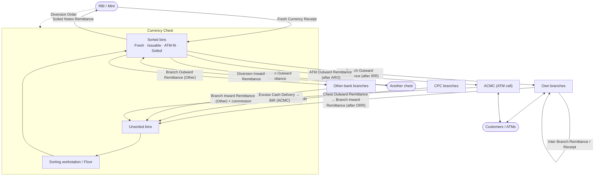

### 39.2 One note's life (narrated)

1. A ₹500 note is printed and issued by RBI; the chest **indents** and **receives** it (*Fresh Currency Receipt*) → **sorted Fresh bin**.
2. Pune Branch **requests** cash (IRR); the chest **withdraws** the note from the bin and **dispatches** (BOR); the branch **receives** (CIR).
3. A customer withdraws it; another customer later deposits it at Pune Branch.
4. The branch sends surplus (ORR → COR); the chest **receives** (BIR) into an **Unsorted bin**.
5. The note goes to a **workstation** and is **sorted** — it is now worn → **Soiled bin**.
6. RBI issues a **Soiled Remittance Order**; the chest **withdraws** and **remits** it (*Soiled Notes Remittance*) to RBI; **incentive** accrues; RBI **receives** it and eventually destroys it (outside CCMS).
7. Alternatively, it could have been found **fake** → *Fake Currency Note Record* + **Debit Note** to the depositing branch + Finacle posting; or **mutilated** → *Debit Note (Half/NIL)* + **Soiled Notes Remittance (Adjudicated)**.


---

## 40. CCMS Module Map

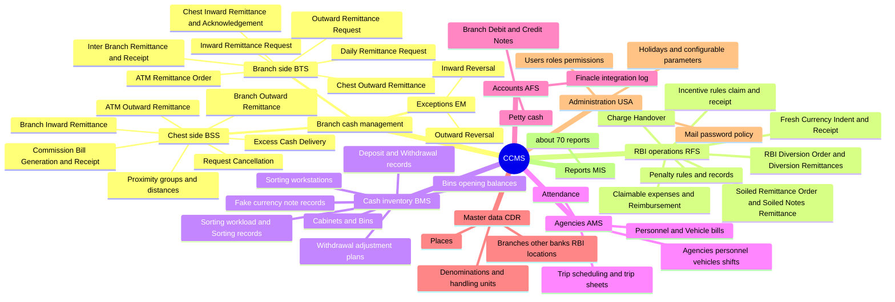

### 40.1 "Why does this exist?" for every module

| Module | Why it exists | Real-world problem solved | Who uses it | Without it | Physical / business event it represents |
|---|---|---|---|---|---|
| **BTS** (branch side) | Branches must ask for and hand over cash formally | Informal phone/e-mail requests, no proof of dispatch/receipt | `BU`, `BM`, `AU`, `AH` | No audit trail; disputes over who sent/received what | A request, a van leaving the branch, a receipt |
| **BSS** (chest side) | The chest must serve and receive cash and reconcile | Supply, collection and counting at the vault | `WO`, `BO`, `LA` | Stock and balances wrong; no link between dispatch and receipt | Vault staff counting and loading cash |
| **RFS** | Currency chests are RBI's outposts | Getting fresh notes, returning soiled, following diversion orders, claiming incentives/reimbursements, tracking penalties | `LA`, `WO` | RBI compliance and revenue leakage | Indent/receipt from RBI, soiled shipments, diversions |
| **BMS** | Cash must be findable and countable | Bundles get lost/misplaced; sorting differences | `WO`, `BO`, `LA` | Book vs physical mismatch | Putting bundles in bins; machine sorting |
| **AMS** | Vehicles/guards are contracted and paid | Planning trips (max branches per duty plan, max distance per trip, guards by amount) and billing accurately | Chest staff, `LA` | Overpaying or unsafe/under-guarded trips | A van trip with driver/guard/loader/custodian; monthly bill |
| **AFS** | Money consequences of cash events | Shortages/fake/mutilated notes must hit the right ledger; petty cash | `LA`, `CA`/`HU` | Losses unbooked; no core-banking link | Debit/credit note; posting to Finacle; petty cash spend |
| **EM** | Mistakes happen | Correcting an approved dispatch without deleting history | `LA`, `BM` | Wrong data stays or is silently edited | A reversal |
| **CDR** | Everyone must use the same reference data | Inconsistent names/codes | `CA`, `HU` | Free-text chaos | The bank's branch network, RBI offices, denominations |
| **USA** | Security and configuration | Who can do what; holidays; limits | `CA`, `LA` | No control | Staff onboarding; policy |
| **MIS** | Management and RBI need numbers | Manual compilation | all | No visibility | Reports |

---

## 41. Concept Relationships

```
Bank
 └── Branches Master
      ├── Currency Chest (Is Currency Chest = Yes)
      │     ├── Retention Limit ................. (chest attribute; reported, enforcement not shown)
      │     ├── Linked RBI Location ............. (where indents/soiled go)
      │     ├── Cabinets ── Bins ................ (where stock physically sits)
      │     ├── Workstations, Floor ............. (where sorting happens)
      │     ├── Configurable Parameters ......... (limits, commission rate, cut-off…)
      │     ├── Holidays Calendar ............... (working days)
      │     ├── Proximity Groups & Distance Matrix (routes)
      │     ├── Agencies, Vehicles, Personnel ... (carriers and crew)
      │     ├── RBI Operations .................. (fresh, soiled, diversion, incentives, penalties…)
      │     └── Other-chest operations .......... (only via RBI Diversion Orders)
      ├── Ordinary Branch ──linked to──► one Currency Chest
      ├── CPC Branch, ACMC Branch (flags on the branch)
      └── Other-bank branches (separate master) ──► commission-bearing counterpart
```

In plain English:

* **A branch is linked to a chest** so that the chest knows whom it serves and the branch knows where to draw/return cash.
* **A chest has bins/cabinets/workstations** because it must know *where* every bundle is.
* **A chest has a retention limit** because RBI expects it to hold cash within a range; the limit is reported but (in the code reviewed) not enforced.
* **Requests point to dispatches; dispatches point to receipts** (IRR ← BOR ← CIR; ORR ← COR ← BIR) so nothing goes unmatched.
* **Approved dispatches/receipts move the balance logs; deposits/withdrawals move the bin logs.**
* **Discrepancies lead to debit/credit notes**, which use the **account numbers on the branch master** to post to Finacle.
* **Agencies/vehicles** are attached to remittances (who carried it) and to **trip schedules and bills**.
* **RBI** connects to the chest only: fresh in, soiled out, diversion orders, incentives, penalties, reimbursements.
* **The holidays calendar and configurable parameters** constrain dates, amounts and planning.

---

## 42. Common Confusions

| Confusion | Clarification |
|---|---|
| **Branch vs Currency Chest** | A chest *is* a branch with a vault flag; it stores large stock, talks to RBI and serves other branches. An ordinary branch keeps working cash and is linked to a chest. |
| **Inward vs Outward** | The word is from the viewpoint of **whoever records the transaction**, and the *counterparty* is in the name. *Branch Inward Remittance* = chest receives from a branch; *Chest Inward Remittance* = branch receives from the chest. See §14. |
| **Cancellation vs Reversal** | Cancellation stops something not yet fulfilled (status CANCELLED). Reversal undoes an approved dispatch and creates a reversal record (status REVERSED). See §35. |
| **Soiled vs Mutilated vs Fake** | Soiled = genuine, worn out → RBI. Mutilated = genuine but damaged → value decided ("adjudicated") by RBI, debit note Half/NIL/Full. Fake = counterfeit → impounded, debited at full value, penalised by RBI in some cases. See §23. |
| **Maker vs Checker** | Maker prepares; checker approves. Different people; different screens. See §10.3. |
| **Request vs Remittance** | A request asks; a remittance records the actual cash movement. See §14. |
| **Remittance Order vs Receipt** | An *order* is an instruction (from RBI or the ATM cell); a *receipt* records arrival. |
| **Cash in Transit vs Chest Inventory** | In transit = dispatched but not received; inventory = booked in bins. See §25. |
| **Bin vs Cabinet** | A bin is a compartment for one denomination/category; a cabinet is the unit that contains several bins. |
| **Sorting vs Remittance** | Sorting is an *internal* chest process (grading cash); a remittance is *movement between places*. |
| **Diversion vs normal chest transfer** | Diversion is *ordered by RBI*, has validity and pending amount; there is no other chest-to-chest screen. |
| **RBI Incentive vs RBI Reimbursement** | Incentive = rate-based reward for handling; reimbursement = repayment of actual bills. |
| **Shortage vs Excess** | Shortage = received less; excess = received more; different notes (debit vs credit note). |
| **Chest Slip vs Control Sheet** | Chest slip = book position per denomination; control sheet = reconciliation of the slip with physical locations. |
| **IRR vs BOR** | IRR = the branch's *request*; BOR = the chest's *dispatch*. |
| **Branch retention limit** | Doesn't exist; only the chest has a retention limit. |
| **`FCR`, `CDR`** | Each abbreviation has two uses in the code (Fresh Currency Receipt vs Fake Currency Records; Cash Deposit Records vs master-data module). |
| **"ITAM", "CEV", "CBL"** | Not explained in the application; do not assume expansions. |

---

## 43. Frequently Asked Questions

1. **Who sends the money, who receives it?** Look at the screen name pair; the sender records a "… Outward …" (or delivery) transaction, the receiver a "… Inward …" (or receipt) transaction — always referencing the sender's record. §14.
2. **Why does RBI appear at all?** Notes belong to RBI's supply chain: RBI issues fresh notes, takes soiled ones, orders diversions, pays incentives and levies penalties. §8.
3. **Why is the chest involved in branch cash?** It is the controlled stockpoint that supplies and absorbs branch cash. §5.
4. **What exactly is being moved?** Physical notes and coins, counted per denomination in handling units (bundles), valued in ₹.
5. **What does inward mean? What does outward mean?** Into / out of the location *of the person recording*. §14.
6. **Why is there a bin?** To give each bundle an address so the book balance can be matched to physical stock. §21.
7. **Why is currency sorted?** To grade raw cash into fresh/issuable/ATM-fit/soiled etc. and to catch fake/mutilated notes. §22–23.
8. **What happens to bad notes?** Soiled → RBI; mutilated → debit note + RBI adjudication; fake → register, debit note, penalty rules, Finacle. Some steps are not documented. §23.
9. **What is a diversion?** An RBI order moving currency between chests. §19.
10. **What happens when the amount is wrong?** The difference is recorded; the receipt can still close; a debit/credit note books the loss/gain. §24.
11. **Why is there a checker?** Four-eyes control on high-risk cash movements. §10.3.
12. **Why does a transaction have several statuses?** Approval and physical progress are independent (Checker vs Status). §27.
13. **Is there a retention limit for branches?** No. §5.4.
14. **Can a chest send cash to another chest directly?** Only under an RBI diversion order. §20.
15. **Who can cancel?** Roles granted the *Request Cancellation* screen; also via checkbox/rejection paths. §34.
16. **What if a van is stopped or the cash doesn't arrive?** The dispatch stays *OPEN* (cash in transit). A reversal/cancellation may be used; the physical loss handling itself is not documented in the application. §25, §35.
17. **What do "Lakh" and "Crore" mean?** 1 lakh = 1,00,000; 1 crore = 1,00,00,000.
18. **How are custodians recorded?** Two custodian names (or personnel selected from the agency's staff) on dispatch screens.
19. **Where do transaction IDs come from?** `FunctionCode-BranchCode-ddMMyy-HHmm-Number`.
20. **How does the system know a date is a holiday?** From the chest's *Holidays Calendar* (weekday flags with frequency).

---

## 44. If I Join the CCMS Project Tomorrow

**Read this order:** §1 → §5 → §14 → §15/§16 → §10 → §21/§22 → §17–§19 → §24 → §27 → §37 → §38.

After reading you should be able to say — and the section that backs each line:

* ☐ I understand what CCMS is (§1–3).
* ☐ I understand what a Currency Chest is and how it differs from a branch (§5, §7).
* ☐ I understand how a branch interacts with a chest: **IRR → BOR → CIR** and **ORR → COR → BIR** (§14–16).
* ☐ I understand how cash moves and where it lands (§9, §39).
* ☐ I understand RBI's role (§8).
* ☐ I understand fresh currency (§17), soiled currency (§18), diversion (§19).
* ☐ I understand bins and sorting (§21–22).
* ☐ I understand discrepancies and the debit/credit note path (§24).
* ☐ I understand Maker/Checker (§10.3, §26) and statuses (§27).
* ☐ I understand the important transaction types (§11.3, §14) and the reports (§37).
* ☐ I can follow one real transaction end-to-end (§38).

**Traps to remember on day one**

1. *Inward/Outward* are from the recorder's viewpoint. Don't translate them literally.
2. Most business rules live in **stored procedures**; only a handful are in `SQL/`. Expect to look in the database for the rest.
3. Role checks in C# only change *what a page shows*; permission to open a page comes from the **Role Authority Matrix**.
4. Several page titles are copy-pasted (see §46.3) — trust the URL/file name, not the heading.
5. The daily-remittance generator has **no visible trigger** in the repo (§31).

**Next step:** the second document, *CCMS Technical Implementation & Codebase Deep Dive*, maps every concept above to pages, classes, procedures and tables.

---

## 45. Master Glossary / Quick Reference

### 45.1 Alphabetical quick reference

| Term | Simple English | CCMS meaning | Related | Example |
|---|---|---|---|---|
| ACMC | ATM cash unit (*full form not confirmed*) | Branch flag; agency category; roles AH/AU | ARO, AOR, ECD | ACMC Head approves ATM order |
| Adjudicated | Value decided by RBI | Soiled-remittance category; incentive category; reimbursement type | Mutilated | Torn note sent to RBI |
| AOR | ATM Outward Remittance | Chest issues ATM cash | ARO | ₹2 cr to ATM cell |
| ARO | ATM Remittance Order | ACMC's request to chest | AOR | — |
| Bin | Storage compartment | One denomination/category | Cabinet | Bin 03-05 |
| BIR | Branch Inward Remittance | Chest receives from a branch | COR | ₹15 lakh from Pune |
| BOR | Branch Outward Remittance | Chest dispatches to a branch | IRR, CIR | ₹25 lakh to Pune |
| Cabinet | Storage unit | Holds bins | Bin | CAB-03 |
| Cash in Transit | Cash on the road | Dispatched, not yet received | BOR/COR | van en route |
| Charge Handover | Change of chest in-charge | Record + cash snapshot | Chest Head | leave replacement |
| Checker | Approver | Approves maker's entry | Maker | LA/BM/AH |
| CIR | Chest Inward Remittance | Branch receives from chest | BOR | — |
| COR | Chest Outward Remittance | Branch dispatches to chest | ORR, BIR | — |
| Credit Note | Credit to a branch | Excess cash found | Debit Note | ₹1,000 excess |
| Currency Chest | RBI-authorised vault | Branch with chest flag | Retention Limit | Pune Chest |
| Custodian | Person accompanying cash | Two names per dispatch | Agency | — |
| Debit Note | Charge to a branch | Shortage/fake/mutilated | Finacle | 4 × ₹500 short |
| Denomination | Note/coin value | Master | Handling Unit | ₹500 |
| Diversion | RBI-ordered chest-to-chest cash | RDO + DOR/DIR | RBI | ₹10 cr to Nashik |
| ECD | Excess Cash Delivery | ACMC returns cash | BIR (ACMC) | — |
| FCI / FCR | Fresh Currency Indent / Receipt | Demand / arrival of fresh notes | RBI | ₹5 cr |
| Floor | Working area | Stock outside bins/workstations | Control Sheet | — |
| Handling Unit | Packaging unit | Bundle = count per unit | Denomination | 100 notes |
| IRR | Inward Remittance Request | Branch asks for cash | BOR | — |
| Maker | Preparer | Creates the entry | Checker | BU/WO/AU |
| Mutilated | Damaged note | Debit note half/NIL/full | Adjudicated | — |
| ORR | Outward Remittance Request | Branch asks chest to collect | COR | — |
| Proximity Group | Nearby branches | One trip for several | Trip scheduling | Pune East |
| Reversal | Undo approved dispatch | EM module, REVERSED | Cancellation | wrong vehicle |
| Retention Limit | Chest cash ceiling | Chest attribute (lakhs) | Control Report | — |
| SNR / SRO | Soiled Notes Remittance / Order | Soiled cash to RBI / RBI's order | Incentive | — |
| Sorting | Grading notes | Unsorted → sorted bins | Workstation | — |
| Workstation | Sorting machine station | Manual/Automatic | Sorting | WS-01 |

### 45.2 Business vocabulary in screen names

| Word in screen name | Why it's called that (real-world meaning) | Tag |
|---|---|---|
| **Indent** (*Fresh Currency Indent*) | A formal requisition for supply of goods; here the chest's formal demand to RBI for fresh notes | [DOMAIN] |
| **Remittance** | Sending cash from one place to another | [DOMAIN + APP] |
| **Challan** | A payment/delivery document issued against a transaction (RBI Challan on fresh receipts) | [DOMAIN] |
| **Mint** | Currency printing/minting unit (checkbox on receipts/remittances) | [DOMAIN] |
| **Adjudicated Notes** | Mutilated notes whose value RBI decides | [DOMAIN] |
| **Diversion** | Redirecting currency to a different chest | [APP] |
| **Proximity Group** | Group of branches close to each other for combined trips | [APP] |
| **Trip Sheet / Speedometer** | Log of a vehicle trip (start/end reading, distance) | [APP] |
| **Gunman / Security Guard** | Armed escort; required numbers depend on amount (parameters *Max Amount for No / 1 / 2 Gunman*) | [APP] |
| **Empanelment** | Date an agency was approved to work with the bank | [APP label "Date of Empanelment"] |
| **Duty Plan / Shift** | Planned assignment of crew and vehicles for a trip / working period | [APP] |
| **Chest Slip** | Daily statement of the chest's holdings | [APP] |
| **Control Sheet** | Reconciliation of book balance vs physical locations | [APP] |
| **Bin Aging** | How long stock has sat in a bin | [APP] |
| **Debit Note / Credit Note** | Documents that charge / credit a branch's account | [DOMAIN + APP] |
| **Petty Cash Voucher / Receipt** | Record of small cash spent / received | [DOMAIN + APP] |
| **Commission Voucher Client Branch** | *Voucher for commission* related to a client branch | [UNCLEAR] |
| **Charge Handover** | Handing over the chest's responsibility | [DOMAIN + APP] |
| **Reimbursement Receipt** | Proof that RBI repaid an expense | [APP] |
| **Lac / Lakh** | 1,00,000 (the retention limit is entered "in Lacs") | [APP] |

---

## 46. Source / Uncertainty Notes

### 46.1 What this document is based on
The full application source (`CCMS/`, `BLL/`, `DAL/`, `CDAL/`), the ~70 MIS report pages, the master pages, the enums in `CDAL/UtilityClass.cs`, the checked-in SQL (`SQL/*.sql`, `SQL/*.txt` — 4 upserts (BOR, COR, diversion inward/outward), 20+ list/print procedures, credit-note upsert, debit-note list, two MIS reports), the scheduler (`BLL/Scheduler.cs`) and the Finacle XML samples. **No external reference document was available.**

### 46.2 Things not confirmed or not documented

| Topic | Status |
|---|---|
| Full forms: ACMC, CPC, DSB, CMA, HKA, CBL, SBN, UET, ITAM, BOM, SBI, Lob | not confirmed |
| `CEV` | not present in the application |
| Enforcement of the chest retention limit | not shown (may exist in DB) |
| Branch-level retention limit | does not exist |
| What the ITAM Maker/Checker do | not shown |
| Exact composition of *Cash In Transit* report and *Cash Holding* | in unseen procedures |
| Reversal eligibility and effects; reversal reason list | in unseen procedures/data |
| Whether inter-branch transactions change the chest balance | not shown |
| Currency category list and IDs (`CurrNoteID`) | data-driven; no maintenance screen |
| What triggers the Daily Remittance generator | not in repository |
| Post-impound handling of fake notes; sticky-note flow; RBI-side handling of soiled notes | not documented |
| Meaning of "Counter Payment?", "Commission Voucher Client Branch", "ATM Cell Document Reference", "IsRemind", "Reversible" petty-cash head | unclear |
| Dynamic plans (Deposit/Withdrawal plan, Duty planning) algorithms; Adjustment-plan screens (`BMSAdjustmentPlan*`, `BranchRemmitanceForUET`, `Manish_RD`) | seen only at label level |
| Stored-procedure logic for most other transactions | not in repository; statuses for those inferred from the same pattern |
| Role Authority Matrix contents (who may open what) | data-driven |

### 46.3 Inconsistencies noticed in the UI/code (useful to know)

The items below are the **in-form title labels** (`lblFormTitle`). The browser/page title comes from the function master in the database (`Master.PageTitle = functionName`) and may well be correct — only the label shown inside the form is wrong.

* `EM/OutwardReversal.aspx` form title reads **"Inward Reversal"**.
* `BTS/ATMRemittanceOrder.aspx` form title reads **"Chest Inward Remittance"**.
* `AMS/PersonnelAttendanceRecords.aspx` form title reads **"Soiled Notes Remittance"**; `AMS/AgencyBillVoucher.aspx` form title reads **"Personnel Bill Generation"**; `AMS/DutyShiftsMaster.aspx` form title reads **"Empanelled Agencies Master"**; `RFS/RBIIncentiveRules.aspx` form title reads **"Soiled Notes Remittance"**; `RFS/SoiledRemittanceOrder.aspx` form title reads **"Contracted Personnel Types"**; `MIS/FreshCurrencyIndentvsReceiptReport.aspx` form title reads **"Chest wise and Branch wise Users List"**; `MIS/RBIDeliveryReportsSummaryReport.aspx` form title reads **"Currency Notes Sorting Summary"**.
* Typos: *"RIB Debit Date"*, *"Vehical"*, *"Reimbursment"*, *"Descrepancies"*, *"Remmitance"* (in file/class names), *"Ageny Name"*.
* `NoteType.MutilatedQuantity_FullValue` is described as **"Shortage"**; a debit-note type of *Shortage* is therefore stored under a *Mutilated* key.
* `FCR` and `CDR` abbreviations each have two meanings.
* The `FinacleIntegration/` folder in the web project holds **sample/log XML files** (including some with test/sample account numbers) — treat as data, not documentation.

### 46.4 How to extend this document
When the "Technical Implementation & Codebase Deep Dive" is written, each **[INFERRED]** and **[UNCLEAR]** item above should be settled by reading the database procedures (`BSS_*`, `BTS_*`, `RFS_*`, `BMS_*`, `EM_*`, `MIS_*`, `_PROC_*`) and the reference data (currency categories, reversal reasons, role matrix), then this document should be updated.
